# Fisica

[TOC]

## 18/02/2019

### Metodo Scientifico

> Fenomeno di interesse e sua idealizzazione, ho grandezze fisiche per descriverlo (**unità**), osservazione e misura (**incertezze**), formulazione di ipotesi, passando dal **modello alla legge fisica**.
>
> Attraverso quest'ultima (legge fisica) è possibile descrivere e prevedere ed in caso **falsificare l'ipotesi.**

---

### Unità del sistema internazionale

#### Grandezze fisiche e la loro misurazione

#### Incertezza di misura

#### Grandezze Fondamentali

#### Sistemi di Unità di Misura

#### Sistema Internazionale

#### Cifre significative e Arrotondamenti

---

### Cinematica

La cinematica è la descrizione del moto degli oggetti, rappresentati da punti materiali.

> **Punto materiale**: Punto con delle proprietà fisiche, privandolo dell'estensione. Lecito quanto piccolo è l'oggetto.
>
> *(Più piccolo, più lecito).*

Esempio:

*Luna è un punto materiale con un rapporto 100 alla terra*.

#### Legge oraria del moto

Scelgo un **punto**, un **verso di percorrenza** e creo il movimento del punto in **UNA dimensione.**

Un punto materiale non fa spazio ne ingombro.

Posso assumere una unità di misura nella retta orientata (tipo centimetri).

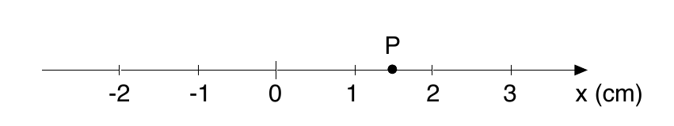

La legge oraria posso esprimerla con una **tabella**:

| $t(s)$ | $s(m)$ |
| :----: | :----: |
|   0    |   2    |
|   1    |   0    |
|   2    |   -1   |
|   3    |   1    |
|   4    |   4    |

E disegno un **GRAFICO**:

> **Equazione oraria**: $s=s(t)$

**spazio** in funzione del **tempo**.

La legge oraria può variare in base alla funzione che ho su $s(t)$

*Esempi*

s=$A \cos(Bt)$

> Nota bene che:
>
> **NON** posso rimuovere la costante A, mentre posso rimuovere la costante B(se ad esempio la B vale 1), ma è consigliato tenerla in ogni caso. Senza A non posso dire di che cosa si tratta, di lunghezza, di tempo etc etc, quindi A deve essere **DEFINITA** ed avere una unità di misura.

> **Pulsazione**: la **formula** **precedente** è la legge oraria che descrive un moto armonico (ad esempio: una molla, un pendolo). Il pendolo oscilla attorno alla condizione di riposo con pulsazione $\omega=B$.

#### Velocità media

Velocità positiva 

Velocità negativa

> **Equazione:** $V_m={\Delta x\over\Delta t}$

Ovviamente ha una unità di misura

$[v]={[s]\over[t]}$

Le parentesi quadre indicano una equazione dimensionale, stiamo considerando l'uguaglianza dal punto di vista delle **dimensioni**.

Abbiamo ovviamente una **unità di misura**

$udm(v)={udm(s)\over udm(t)}={m\over s}$

*può essere metri al secondo come altro(km/h...)*

> Nota che **è una differenza, non dipende dal sistema di riferimento (origine degli assi) che abbiamo utilizzato**.

utilizzando il sistema di riferimento di prima (**tabella**), abbiamo:

${-2\over1}=-2{m\over s}$

$-1{m\over s}$

$2{m\over s}$

$3{m\over s}$

> **Coefficente Angolare: ** Nel grafico ho
>
> **$m={\Delta y\over\Delta x}$**

> Nota bene che **il grafico con tempo, non può avere valori che "tornano indietro nel tempo".**

#### Velocità istantanea

> La velocità istantanea è la velocità media relativa a un tempo infinitesimo.

$\lim_\limits{\Delta t \to 0}{\Delta x\over \Delta t}=v$

anche detta

> $\lim_\limits{\Delta t\longrightarrow0}{\ x(t)-x_0\over t-t_0}=v(t)$ 
>
> Rapporto incrementale, quindi è la **derivata** nel grafico **spazio tempo.**

*Esempi:*

$s(t)=At \Longrightarrow v(t)={ds\over dt}=A$

Essendo t Tempo, **A sarà spazio tempo perchè mi fornisce un uguaglianza = spazio, quindi deve dare spazio.** Quindi A sarà la **Velocità**.

$v(t)=A[-\sin(\omega t)]\omega=-A\omega \sin(\omega t)$

In questo caso A è **Spazio**.

Avendo la **legge oraria della velocità**, posso ottenere la **legge oraria del moto** integrando $v(t)$

> $s(t)-s_0=\int^t_{t_0} d\tau v(\tau) \Longrightarrow s(t)=s_0+\int_{t_0}^t d\tau v(\tau)$

quindi

$s(t)=s_0+\int^t_{t_0}\bar{v}d\tau=s_0+\bar{v}(t-t_0)$

Avendo una velocità costante ottengo

$s(t_0)=s_0+\bar{v}(t_0-t_0)=s_0$

#### Accelerazione

> **Derivata** della velocità nel tempo
>
> $\lim_\limits{\Delta t \to 0}{\ v(t)-v(t_0)\over t-t_0}=a(t_0)$ 

> **Protip**: Controllo di avere consistenza dimensionale
>
> $[a]={[v]\over[t]}={[s]\over[t][t]}=[s/t^2]$

##### Accelerazione Gravitazionale 

> L**'accelerazione gravitazionale** è pari a
>
> $g=9,80665{m\over s^2}$

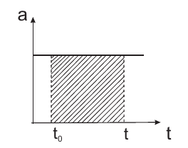

> **Punti estremali** (o punti stazionari): Punti di massimo e di minimo di un grafico (punti in cui la derivata della funzione è zero). In un grafico velocità - tempo, nei punti di massimo e di minimo il corpo non subisce nessuna accelerazione (derivata della velocità in funzione del tempo = accelerazione). Analogamente, in un grafico spazio - tempo nei punti stazionari la velocità del corpo è zero (derivata dello spazio in funzione del tempo = velocità).

#### Integrale della velocità

> $v(t)=v_0+\int_{t_0}^t d\tau a(\tau)$

*Nota che:*

**Integrando** accelerazione, ottengo la **velocità**.

**Integrando ancora** , ottengo lo **spazio**.

**Derivando** lo spazio, ottengo la **velocità**.

**Derivando ancora** ottengo **l'accelerazione**.

> **Protip**:
>
> $F={-G\cdot m\cdot M\over r^2}={-m\cdot g\cdot r}$
>
> L'accelerazione gravitazionale è **diversa** in base a dove mi trovo sulla Terra, ma di poco, quindi la **assumo** come **costante**.

#### Esercizio

**Protip**: Io posso piazzare il mio asse delle $x$, cioè s(t) come mi pare e piace, di conseguenza si modifica il segno dell'accelerazione di gravità. Se $x$ cresce al crescere della distanza da terra, allora $g$ sarà **negativa**, altrimenti è viceversa.

> Un tipo tira un sasso in aria
>
> DATI:
>
> $v_0=?$
>
> $h=4,0 m$

$s_0=0, t_0=0$

$a=+g (g=-9,81 m/s^2)$

$v(t)=v_0 >0 + \int ^t _0 d\tau a(\tau)=v_0+\int ^t _0 d\tau g=v_0+gt$

dove g è ovviamente l'accelerazione gravitazionale.

$s(t)=s_0+\int_{t0}^t d\tau v(\tau)=\int_0^t d\tau (v_0+g\tau)=v_0t+g{t^2\over2}$

---

---

## 22/02/2019

Ricordiamo che **l'accelerazione** è la **derivata** della velocità rispetto al tempo

${dv\over dt}=a$

tornando all'esercizio precedente, otteniamo 

$\begin{cases} v(t)=v_0+gt \\ s(t)=v_0t+{1\over 2}gt^2 \end{cases}$

Ora nel punto in cui la velocità è zero:

$\begin{cases} v(t)=0=v_0+gt_{max} \\ s(t)=h_{max}=v_0t_{max}+{1\over 2}gt_{max}^2 \end{cases}$

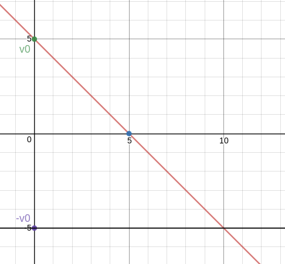

Continuando:

$\begin{cases}v_0=-gt_{max} \\h_{max}=-{1\over2}gt^2_{max}\end{cases}=\begin{cases} v_0=-g\sqrt{2h_{max}\over-g}=\sqrt{|g|^2{2h_{max}\over-g}}=\sqrt{-2gh_{max}}=8,9m/s\\t_{max}=\sqrt{2h_{max}\over-g}=\sqrt{8m\over9,8m/s^2}=\sqrt{0,816}\end{cases}$

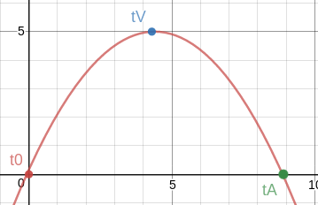

#### Esercizio: Doppio lancio vericale

Vengono lanciati due sassi

> **DATI**: 
>
> $v_0=8,0 m/s$
>
> $a=g=-9,81m/s^2$
>
> $s_0=0m$
>
> $t_{0A}=0s$
>
> $t_{0B}=$Arbitrario

Si incontrano per $s>0$?

Se aspetto che il primo sasso vada a terra, **no.**

Come possiamo vedere, la possibilità che si incontrino è **nell'intersezione delle due parabole.**

1. **Primo Caso/Modo:** $t_{0B}>t_{LA}=2t_{max}=2\sqrt{-2h_{max}\over g}$

   se ho che lo lancio dopo il landing dell'altro.

2. **Secondo Caso/Modo**:
   $\begin{cases}s(t)=v_{0A}(t-t_{0A})+{1\over2}g(t-t_{0A})^2 \\s(t)=v_{0B}(t-t_{0B})+{1\over2}g(t-t_{0B})^2\end{cases}$ ottengo $\cancel{v_0t+{1\over2}gt^2}=v_0(\cancel{t}-t_{0B})+{1\over2}g(\cancel{t}-t_{0B})^2$

   **Ottengo** dunque che

   $0=-v_0\ t_{0B}+{1\over2}gt^2_{0B}-gt_{0B}$

   **arrivando** a $t$

   $t={{1\over2}gt^2_{0B}-v_0t_{0B}\over gt_{0B}}={t_{0B}\over2}-{v_0\over g}$

### Grandezze vettoriali

$s\longrightarrow\vec{s}$

$v\longrightarrow\vec{v}$

$a\longrightarrow\vec{a}$

Ci sono diversi tipi di **sistemi di coordinate**

1. **Cartesiano**
   

2. Cilindrico  

3. Polare

   

Una grandezza vettoriale nello spazio è descritta quindi da un vettore con tre entrate, corrispondenti (nel caso di un sistema di coordinate cartesiano) all'intensità della grandezza lungo ciascuno degli assi:

$ s\longrightarrow \Delta\vec{s}=\bigg(\begin{smallmatrix}\Delta s_x\\\Delta s_y\\\Delta s_z\end{smallmatrix}\bigg)=\Delta s_x \ \hat x + \Delta s_y \ \hat y + \Delta s_z \ \hat z$

Dove con $\hat x$ si intende il versore relativo all'asse $x$, cioè il vettore $\hat x = \bigg(\begin{smallmatrix}1\\ 0 \\ 0\end{smallmatrix}\bigg)$, allo stesso modo $\hat y = \bigg(\begin{smallmatrix}0\\ 1 \\ 0\end{smallmatrix}\bigg)$ e $\hat z = \bigg(\begin{smallmatrix}0\\ 0 \\ 1\end{smallmatrix}\bigg)$.

Analogamente per il vettore velocità media:

$\vec{v}_M={\Delta\vec{s}\over\Delta t}=\Bigg(\begin{smallmatrix}{\Delta x\over\Delta t}\\{\Delta y\over\Delta t}\\{\Delta z\over\Delta t}\end{smallmatrix}\Bigg)=\bigg(\begin{smallmatrix}{v_x}\\{v_y}\\{v_z}\end{smallmatrix}\bigg)= v_x \ \hat x + v_y \ \hat y + v_z \ \hat z$

#### Velocità istantanea in più dimensioni

> $\vec{v}(t)=\lim_\limits{t'\to t} {\vec{s}(t')-\vec{s}(t)\over t'-t}$

Si vede, per come è definito il vettore $\vec v$, che **la sua direzione è uguale a quella dello spostamento $\vec s$**.

#### Accelerazione in più dimensioni

> $\vec{a}(t)=\lim_\limits{t'\to t} {\vec{v}(t')-\vec{v}(t)\over t'-t}$

Una grandezza vettoriale è caratterizzata da una **intensità** (lunghezza del vettore), da una **direzione** (retta sulla quale giace il vettore) e da un **verso** (uno dei due possibili sulla retta direzione). Può quindi esserci, ad esempio, una variazione di velocità (accelerazione) sia se cambia l'intensità della velocità, sia se cambia la sua direzione. Ad esempio: se un corpo viaggia inizialmente con velocità $v_1 = 5 \hat x \frac{m}{s}$ (5 metri al secondo lungo la direzione dell'asse x) e poi modifica la sua velocità in $v_2 = 5 \hat y \frac{m}{s}$ c'è stata una accelerazione (l'intensità del vettore velocità non è cambiato, ma la direzione sì).

Possiamo avere

1. Moto rettilineo uniforme **(MRU)**
2. Moto rettilineo uniforme vario **(MRVA)**
3. Moto non rettilineo uniforme **(MNRU)**
4. Moto non rettilineo non uniforme **(MNRNU)**

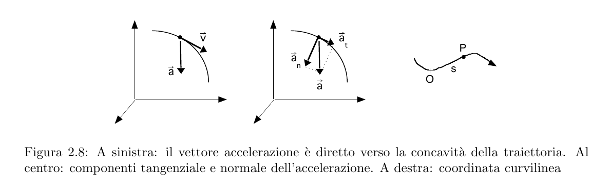

### Moto circolare uniforme

> Un corpo in moto circolare uniforme percorre una traiettoria circolare, con velocità **scalare** (intensità) costante.

Per una circonferenza di raggio $r$, le coordinate sul piano cartesiano in funzione dell'angolo $\phi$ possono essere calcolate tramite la relazione

$\begin{cases}x=r\cos\phi \\y=r\sin\phi\end{cases}$

*In ogni istante, il vettore spostamento e il vettore velocità hanno direzione tangente alla circonferenza.*

In un MCU si può definire la velocità angolare come l'angolo di circonferenza percorso per unità di tempo (se il moto è uniforme, la velocità angolare è costante). La velocità scalare è il prodotto della **velocità angolare per il raggio**.

> **Velocità:** 
>
> $v={ds\over dt}={d(R\phi)\over dt}=R\ {d\phi\over dt}= \omega R$

$\omega$ è la  **velocità angolare.**

Allo stesso modo è possibile definire l'accelerazione angolare $$\alpha$$

> **L'accelerazione**:
>
> $a={dv\over dt}=R\ {d\omega\over dt}=\alpha R$

L'accelerazione è **diretta verso il centro**, cioè **accelerazione** **centripeta**; in un moto circolare uniforme il suo valore scalare è costante.

Accelerazione centripeta in un moto non circolare = **accelerazione normale**.

È normale al moto, perpendicolare.

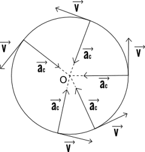

**Nota che**:

Se non ho una circonferenza, posso dire che **l'accelerazione normale** ci porta ad avere un'accelerazione centripeta verso una ipotetica circonferenza per la nostra curva:

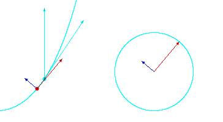

$v_x={dx\over dt}=R{d\cos \phi\over dt}=-R\sin \phi {d\phi\over dt}$

$v_y={dy\over dt}=R{d\sin \phi\over dt}=R\cos \phi {d\phi\over dt}$

**Quindi ottengo che**

> $v=\sqrt{v_x^2+v_y^2}=R{d\phi\over dt}=R\omega$

con le **accelerazioni** 

$a_x={dv_x\over dt}=-R[{\cos \phi({d\phi\over dt})^2}+\sin \phi \xcancel{({d^2\phi\over dt^2})}] = -R \cos \phi \cdot \alpha$ 

$a_y={dv_y\over dt}=R[{-\sin \phi({d\phi\over dt})^2}+\cos \phi \xcancel{({d^2\phi\over dt^2})}] = -R sin \phi \cdot \alpha$

$$a = \Vert (a_x, a_y) \Vert = \sqrt{a_x^2 + a_y^2} = \sqrt{R^2\alpha^2(cos^2 \phi + sin^2 \phi)} = \alpha R$$

> **Nota bene**: ${d^2\phi\over dt^2}={d\over dt}[{d\phi\over dt}]$
>
> dove $[{d \phi\over dt}]$=$\omega$ è costante, quindi la derivata di una costante è **zero**.

## 25/02/2019

> **Velocità angolare:** $v=\omega r$

#### Esercizio palla di cannone

Calcolo della traiettoria di un oggetto sparato con un cannone *(o di qualunque altro corpo con una velocità iniziale soggetto alla forza di gravità).*

Il cannone è posizionato su $(0,0)$ e ha un certo alzo $$\phi$$ (angolo rispetto al terreno). Il cannone imprime sul corpo una velocità iniziale.

Questi esercizi si risolvono nel seguente modo:

1. si scompone il moto nella componente orizzontale (lungo $$x$$ ) e verticale (lungo $$y$$);
2. lungo la componente orizzontale il corpo non subisce accelerazione (si ignora l'attrito dell'aria) e quindi prosegue con un moto rettilineo uniforme
3. lungo la componente verticale il corpo subisce accelerazione $$\vec g = - 9.81 \hat y \frac{m}{s} $$ e quindi prosegue con un moto rettilineo uniformemente accelerato
4. si mettono a sistema le due leggi orarie (quella del moto lungo $x$ e lungo $y$): si usa la legge oraria lungo $y$ per calcolare quando il corpo toccherà terra ($y = 0$) e si inserirà il tempo trovato nella legge oraria lungo $x$ per calcolare la distanza percorsa dal corpo.

$x_0=0$ 	$v_{0x}=v_0\cos\phi$

$y_0=0$		$v_{0y}=v_0\sin\phi$

$\vec{v}_0=v_{0x} \hat{x}+v_{0y} \hat{y} \iff v_o, \phi$

$\begin{cases} x(t)=x_0+v_{0x}t\\ y(t)=y_0+v_{0y}t+{1\over2}at^2\end{cases} \begin{cases} x=v_{0x}t\\ y=v_{0y}t-{1\over2}gt^2\end{cases} \begin{cases} t={x\over v_{0x}}\\ y={v_{0y}\over v_{0x}}x-{1\over2v_{0x}}gx^2\end{cases}$

ottenendo

$x=-{b\over a}= \tan\phi {2v_{0x}^2\over g}={2v_{0x}v_{0y}\over g}$ 

Sottolineo che ho sostituito $y=\tan\phi x -{g\over 2V_{0x}^2}x^2=bx+ax^2$

### Principi della dinamica

#### Primo principio (principio di inerzia):

$\vec{v}=\vec{0}$

$\vec{v}=\vec{costante}$

> Un corpo rimane nello stato di quiete o di moto rettilineo uniforme fintanto che una forza non agisce su di esso.

**Sistema di riferimento inerziale**: un sistema di riferimento in cui è valido il primo principio della dinamica. Sistemi inerziali fra di loro diversi differiscono (al più) per una differenza **costante di velocità**.

Se un sistema di riferimento accelera rispetto ad un sistema di riferimento inerziale, quel sistema di riferimento è detto **non inerziale**.

> **Molto importante:** Se sono sopra un oggetto movente non posso affermare se si sta muovendo, perché mi sto muovendo con esso.

#### Secondo principio (principio di Newton):

##### Esperimenti carrelli

*IMMAGINE che non trovo*

Avendo due carrelli che si tirano tra loro con una molla di mezzo cosa succede?

Beh se i carrelli sono uguali, ho i $\Delta v1=\Delta v2$

altrimenti, se carrello 2 è 2 volte la **massa** del carrello 1 ottengo $\Delta v1=2\Delta v2$

idem se vale 3 ottengo $\Delta v1=3\Delta v2$

Misuriamo quindi la seguente relazione fra massa e accelerazione, a cui diamo il nome di "forza":

> $\vec{F}=m\cdot \vec{a}$

Per una definizione più precisa del concetto di forza, definiamo $\vec p$ **quantità di moto**:

$\vec{p}=m\cdot \vec{v}$

Forza è la variazione della quantità di moto per l'unità di tempo.

Per l'esercizio di prima, con$ v1$ con stessa massa di $v2$ abbiamo

${d\vec{p}_1\over dt}=-{d\vec{p}_2\over dt}$

dove $\vec{F}_1={d\vec{p}_1\over dt}$ $\vec{F}_2={d\vec{p}_2\over dt}$

OTTENENDO

$\vec{F}_1=-\vec{F}_2$

$\vec{F}={d\vec{p}\over dt}={{d\over dt}(m\vec{v}_2)}={dm\over dt}\vec{v}+m {d\vec{v}\over dt}$

Noi sappiamo che $a= {d\vec{v}\over dt}$

>$\vec{F}={d\vec{p}\over dt}$ 
>
>cioè $\vec{F}= m\cdot \vec{a}+ {dm\over dt}\vec{v}$
>
>Spesso nei problemi ${dm\over dt}\vec{v}$ si può ignorare, perché i corpi di cui vogliamo calcolare l'accelerazione o la forza ai quali sono soggetti non hanno una variazione di massa.
>
>Un esempio di corpo che riceve accelerazione da una variazione di massa sono i razzi spaziali.

Unità di misura: **Newton**. $[N] = \frac{[kg] \cdot [m]}{[s^2]}$ =km/h

$\vec{F}={d\vec{p}\over dt}$ 

${d\vec{p}}={\vec{F}}{dt}$

per calcolare la 

**forza media** dobbiamo avere l'impulso.

> **Impulso**: $\Delta \vec{p}=\int^t_{t_0}\vec{F}(\tau)d\tau$

Avendo poi

> **Forza media**: $\vec{\bar{F}}={\Delta\vec{p}\over\Delta t}$

#### Esercizio pallina da tennis

Ho una pallina da tennis, la tiro contro il muro. La pallina rimbalza e torna indietro: la velocità è variata, quindi il moto ha avuto una accelerazione, quindi il corpo ha subito una forza.

Quanta forza è stata impressa dal muro sulla pallina?

$m=150g$ di pallina

$v=36 km/h=10m/s$

otteniamo

$\xcancel{\vec{p}_i=1,5kg\ {m\over s}}$ è sbagliato: la quantità di moto è una grandezza vettoriale

Indichiamo la direzione della quantità di moto moltiplicando il prodotto massa per velocità scalare della pallina per il versore $\hat x$:

$\vec{p}_i=1,5kg\ {m\over s}\cdot \hat{x}$

supponiamo un impatto perfettamente elastico: dopo l'impatto con il muro, la pallina ha la stessa velocità scalare, la stessa direzione ma il verso opposto.

$\begin{cases} \vec{p}_i=1,5kg\ {m\over s}\cdot \hat{x} \\ \vec{p}_f=-1,5kg\ {m\over s}\cdot \hat{x} \end{cases}$

La pallina è rimasta "attaccata" al muro per un certo intervallo di tempo $\Delta t$, durante il quale il muro ha impresso una forza sulla pallina. La variazione di quantità di moto è $\Delta \vec p = \vec p_f - \vec p_i = 2 \vec p_f$. La forza applicata dal muro sulla pallina è quindi $\vec F = \frac{\Delta \vec p}{\Delta t} $.

> **Principio di sovrapposizione:**
>
> Se più forze agiscono su un corpo, l'effetto complessivo delle forze è equivalente alla sovrapposizione degli effetti delle forze (_somma vettoriale delle forze_)
>
> $\vec{F}_{tot}=m \vec{a}_{tot}$

$\vec{s}(t)=\vec{s}_0+\int^t_{t_0} d\tau \vec{v}_0(\tau)+\int^t_{t_0} d\tau+\int^\tau_{t_0} du {\vec{F}(u)\over m}\bcancel{(du-du)}$

**Vi sono quattro tipi di "forze fondamentali". In ordine di intensità crescente:**

1. Forza di gravità

2. Forza debole

3. Forza elettromagnetica

4. Forza Forte

----

----

## 01/03/2019

### Forza di gravità

La massa descrive **quanto intensamente** sento la gravità:

> **Forza che 1 esercita su 2:** $\vec{F}_{1\rightarrow2}=-G{m_1m_2\over r^2_{12}}\hat{r}_{12}$

dove G è la costante di **gravitazione universale**

$G=6,67\cdot 10^{-11} {N\cdot m^2\over kg^2}$

La massa $m_1 $ subisce una forza gravitazionale dalla massa $m_2$ e viceversa. 

La gravità si propaga alla velocità della luce, ma non è istantanea, però per noi abbiamo velocità infinita.

> Nota sulla elettricità:
>
> $\vec{F}=Kel{g1g2\over r^2_{12}}\hat{r}_{12}$ dove $Kel={1\over4\pi\epsilon_0}$

### Forza Peso

Forza con la quale descrivo il fenomeno della caduta dei gravi sulla superfice terrestre.

*Ho un palazzo alto 100 metri, butto un sasso.*

$\vec{F}=-G{Mm\over r^2}\hat{r}$ dove $M$ è la massa della terra, $m$ è la massa del sasso.($\vec{P}=-m\vec{g}$)

> **Teorema della forza centrale:** al fine di calcolare la forza gravitazionale di un corpo, fintanto che la massa è distribuita uniformemente all'interno del suo volume, posso assumere che la massa sia concentrata al centro dell'oggetto.

$\vec{F}=-G{M_Tm\over (R_t+h)^2}=-{GM_T\over R_T^2(1+{h\over R_T})}m$

ora so che

$(1+\epsilon)^\alpha=1+\alpha\epsilon$ con $\epsilon<<1$

quindi

${1\over1+e}=1-\epsilon$

So che 

$-{GM_T\over R_T^2}(1+2{h\over R_T})m=-{GM_T\over R_T^2}$ perchè $(1+2{h\over R_T})$ è dell'ordine di $10^{-5}$

$\vec{F}=G{M_T\over R_T^2}\hat{R_T}$, con una buona approssimazione possiamo quindi ignorare la variazione di forza peso del sasso quando si trova sul terreno rispetto a quando si trova in cima al palazzo (e quindi, tutti i corpi sulla superficie della Terra o a poca distanza da essa subiscono accelerazione $\vec g = -G \frac{M_T}{R_T^2} \hat R_T$).

**La gravità della luna è un sesto della gravità della terra**

Dunque, la forza peso di un corpo sulla luna è un sesto della forza peso che lo stesso corpo avrebbe sulla terra. La massa è invece una proprietà del corpo, e rimane uguale sia sulla Terra, sia sulla Luna, ovunque. 

#### Piano inclinato

I problemi sul piano inclinato si affrontano scomponendo la forza peso del corpo sul piano nella componente normale al piano e nella componente tangenziale al piano.

$\vec{N}+\vec{P}_{perp}=0$

$P_{parall}=P\sin \alpha$

$P_{perp}=P\cos \alpha$

$\begin{cases}t:ma_t=F_t=mg\sin \alpha \\n: ma_n=F_n=0 \end{cases}$

da questo ottengo $a_t=g\sin\alpha$

In assenza di attriti, la componente della forza tangenziale al piano inclinato porta il corpo ad accelerare. Per tenere fermo il corpo, supponiamo di aggiungere una fune

la fune ha una forza $T$ (tensione) che sommata a $P_t $ deve essere $=0$

quindi ottengo 

$\vec{P}+ \vec{N}+ \vec{T}= \vec{0}$

_(Il corpo è in quiete, quindi per il primo prncipio della dinamica la somma delle forze su di esso deve essere zero)_

Supponiamo ora un moto circolare. Il corpo non è in quiete, quindi

$\vec {F}_c=m\vec{a}_c\ne\vec{0}$

Posso immaginare la forza centripeta come una fune che è collegata al centro della circonferenza. Come varia la forza di tensione della fune in funzione della massa del corpo?

Il carico di rottura sale quadraticamente:

$F_c=-m\omega^2R=-G{mM\over R^2}$

otteniamo che 

> **Terza legge di Keplero**
>
> $\omega^2={GM\over R^3}\Longrightarrow_{w={2\pi\over T^2}} {R^3\over T^2}={GM\over4\pi^2}$ dove questa è **costante**.

### Forza di attrito

La forza di attrito è una forza che si oppone al movimento ed è proporzionale alla **reazione vincolare**.

$\vec{F}_a| \vec{F}_t+\vec{F}_A=\vec{0}$

##### L'attrito statico 

L'attrito statico è proprio di un corpo **fermo** che poggia su un piano. Dipende da quanto un corpo "preme" sul piano su cui poggia. Dipende cioè dalla forza peso (o nel caso del piano inclinato, dalla componente perpendicolare al piano della forza peso), che è uguale e opposta a $N$ reazione vincolare del piano. Quindi uso N

> **Nota bene che:**
>
> Se un corpo è fermo, la somma delle forze applicate su di esso è zero.
> Pertanto, se un corpo non è soggetto a forze, anche l'attrito statico è zero.
> Il calcolo dell'attrito statico ci dà la misura della **massima** forza di attrito che può opporsi ad una forza uguale e contraria applicata sul corpo.
>
> $\vec{F}_{a}\le \vec{F}_{a,max}=\mu_S|\vec{N}|\hat{t}$
>
> Questo esiste sempre. $\mu_S$ è il **coefficente di attrito statico**.

##### Attrito dinamico

L'attrito dinamico è proprio di un corpo **in movimento** che **scivola** su un piano.

> $\vec{F}_{AD}=\mu_D|\vec{N}|\hat{t}\longrightarrow \vec{F}_{AD}=-\mu_D|\vec{N}|\hat{v}$

$\mu_D$ è il **coefficiente di attrito dinamico**.

Esercizio:

Si ha un disco rotante a velocità costante sul quale è poggiata la corona inglese, il coefficiente di attrito statico fra il disco e la corona è $\mu_s=0,3$. Qual è la massima velocità angolare $\omega$ tale per cui la corona rimanga ferma sul disco?

## 04/03/2019

### Esercizio: Macchina che frena(senza ABS)

Ho una macchina che frena (supponiamo le ruote si blocchino e quindi c'è attrito dinamico fra le ruote e l'asfalto)

$t_{f}=$tempo frenata$=?$

$s_f=$spazio frenata$=?$

$\mu c$ attrito dinamico dato

$\vec{F}=-\vec{F}_a=m\vec{a}$

$-\mu_cN=m{dv\over dt}$

$-\mu_cN(t-t_0)=m(v(t)-v_0)$

$-\mu_c\bcancel{m}g(t_f-t_0)=m(v_t-v_0)$ dove $mg=N$ e $v_t=0$

ottengo:

$\mu_cgt_f=v_0$

Concludendo

$t_f={v_0\over\mu_cg}\Longrightarrow s_f={1\over2}at_f^2={1\over2}(-\mu_cg){v_0^2\over(\mu_cg)^2}=-{1\over2}{v_0^2\over \mu_cg}$

la posso calcolare integrando

$-\mu_cN{(t-t_0)^2\over2}=m[(s(t)-s_0)-v_0(t-t_0)]$

ottenendo

$-\mu g{t_f^2\over2}=s_f-v_0t_f$

### Esempio della carrucola

Ho due corpi collegati alle estremità di una fune, posta su una puleggia.

Supponendo che la corda **non si estenda**, i due corpi:

1. si muovono a velocità uguali e opposte;
2. le variazioni di velocità sono uguali e opposte.

Posso dunque supporre che $\vec {a}=\vec {a}_1=- \vec{a}_2$

$\begin{cases}m_1\vec{a}=\vec{P}_1+T\\m_2\vec{a}=\vec{P}_2+T\end{cases}\Longrightarrow\begin{cases}m_1\vec{a}=\vec{P}_1-T\\m_2(-\vec{a})=\vec{P}_2-T\end{cases}\Longrightarrow \begin{cases}m_1\vec{a}=m_1g-T\\m_2\vec{a}=T-m_2g\end{cases}$

Otteniamo:

$(m_1+m_2) \vec a=(m_1-m_2) \vec g\Longrightarrow \vec a={m_1-m_2\over m1+m2}\vec g$

Osservo che 

Se le due masse sono uguali, $m_1-m_2=0$ non si muovono! L'accelerazione è nulla.

Se una delle due masse è zero otteniamo "g", quindi ottengo $\vec{a}=\pm g$ cioè uno dei due corpi cade con accelerazione $\vec g$. Se i due corpi hanno masse diverse fra loro e diverse da zero, uno dei due corpi cade con accelerazione minore di $\vec  g$.

### Lavoro

A una massa, come un treno che va per dei binari:

1. applico una forza parallela e **concorde** alla direzione dello spostamento, posso affermare che la forza **avvantaggia il moto**;
2. applico forza parallela **discorde**(che ha il senso opposto) alla direzione dello spostamento, posso affermare che la forza **svantaggia il moto**;
3. applico una forza perpendicolare (applicata ad esempio in "giù") alla direzione dello spostamento, posso affermare che non avvantaggia né svantaggia il moto.

Vogliamo dunque rappresentare una caratteristica della forza applicata ad un corpo in movimento che esprima:

1. quanto a lungo nello spostamento la forza è stata applicata al corpo;
2. come la applico(1,2,3)

> **Lavoro**: Prodotto scalare forza con spostamento.

$W=\vec{F} \cdot \Delta\vec{s}=\Vert F \Vert \Vert \Delta s \Vert \cos(\theta_{F_1\Delta s})$

Dimensionalmente: 

$[w]=[FL]=[M{L\over T^2}L]=[m {L^2\over T^2}]$

**Unità di misura** del lavoro: Joule ($J$) pari a $1N\cdot 1m$. Un Joule è, ad esempio, il lavoro compiuto da una forza di $1N$ per spostare un corpo di $1m$ _nella stessa direzione di applicazione della forza_.

> Questa formulazione del lavoro vale fintanto che la forza è uniforme per tutto lo spostamento.

#### Esempio: Lancio sasso in aria, calcolo del lavoro compiuto dalla gravità

> Considero il moto di un sasso lanciato verticalmente verso l'alto, dal momento in cui lascia la mano alla massima altezza $h$ che raggiunge.

$W_{grav}=\vec{F}\cdot \Delta\vec{s}=$

$\begin{cases}\vec{F}=-mg\cdot\hat{z}\\\Delta\vec{s}=h\hat{z}\end{cases}=\vec{F}\cdot\Delta\vec{s}=-mgh$

$W_{grav}=-mgh$

La gravità compie un lavoro negativo (si oppone al movimento) mentre il sasso muove verso l'alto.

> Quindi, il sasso torna giù

$w_{grav}=\vec{F}\cdot \Delta\vec{s}=$

$\vec{F}=-mg\hat{z}$

$\Delta\vec{s}=-h\hat{z}$

ottengo 

$w_{grav}=mgh$ 

La gravità compie un lavoro positivo (avvantaggia il movimento) mentre il sasso muove verso il basso.

> Consideriamo l'intero moto: il sasso viene lanciato, raggiunge la massima altezza e torna al suolo

$\vec{F}=-mg$

$\Delta\vec{s}=\vec{0}$ quindi $W = 0$

> Caso dove fa dei giri strani

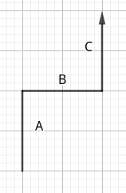

In questo caso

$\begin{cases}w_a=-mg{h\over3}\\w_c=-mg{2\over3}h\\w_b=0\end{cases}$

$w_b=0$ perchè ho $\Delta \vec{s}=0$

ottengo che alla fine, sommandoli, $W_{TOT}=-mgh$.

Questo ci fa capire che il lavoro **compiuto dalla forza gravitazionale** non dipende dal percorso del corpo, ma solo dalla differenza di altezza fra il punto iniziale e il punto finale.

#### Con Forza non costante:

Cosa succede se la **forza non è costante?**

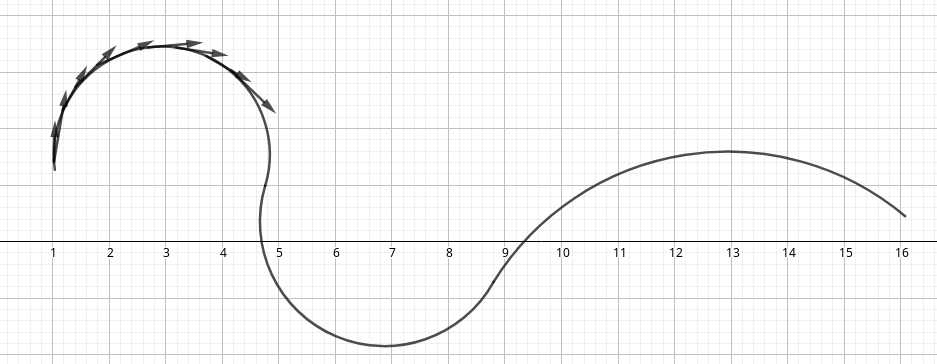

Abbiamo questo grafico che rappresenta l'intensità della forza dal punto $A$ al punto $B$.

Suddivido la curva in spostamenti infinitesimi $d\vec s$, per ciascun spostamento $i$ il corpo percepisce una forza (che suppongo istantaneamente costante) $\vec F_i$. 

$\vec{F_{AB}}=\sum^N_{i=1} \vec F_i \cdot d\vec{s} \longrightarrow_{n\to\infty} \int^B_A \vec{F}\cdot d\vec{s}$

Una definizione più generale di lavoro è quindi

> **Lavoro:** $W_{A\to B}=\int^B_A \vec{F}\cdot d\vec{s}$

### Potenza

##### Potenza istantanea

Lavoro che compie nell'istante di tempo $dt$: $dP = {dw\over dt}$

##### Potenza media

Lavoro medio compiuto per unità di tempo:  $\bar P = {w_{tot}\over\Delta t}$

Unità di misura della potenza è il **Watt** ($W$). 1 Watt corrisponde a un lavoro di 1 $J$ / 1 $s$

----

---

## 08/03/2019

### Forza conservativa

Una forza è conservativa se vale

$W_{a\to a}=0$

cioè $\oint=\vec{F}\cdot d\vec{s}$

qualunque sia il circuito scelto.

> **Teorema**: per una forza conservativa,  $\int^B_A\vec{F}\cdot d\vec{s}$ non dipende dal percorso $A\to B$ 

**Dimostrazione:**

$\vec  F$ è conservativa $\to$ posso costruire un circuito che passa per i punti $A$ e $B$.

"Taglio" il circuito nei punti $A$ e $B$: ho due curve, potenzialmente diverse, che congiungono i punti $A$ e $B$. Le chiamo $I$ e $II$.

$\oint\vec{F}\cdot d\vec{s}=0$

$I\oint^B_A\vec{F}\cdot d\vec{s}+II\oint^A_B\vec{F}\cdot d\vec{s}=0$

$I\oint^B_A\vec{F}\cdot d\vec{s}=-II\oint^A_B\vec{F}\cdot d\vec{s}=II\oint^A_B\vec{F}\cdot d\vec{s}\Longrightarrow wI_{a\to b}=wII_{a\to b}$

Dunque il lavoro svolto dalla forza conservativa sulla curva $I$ è uguale a quello svolto sulla curva $II$ $\to$ il percorso svolto dal corpo è indifferente, il lavoro dipende solo dalla forza, dal punto iniziale $A$ e dal punto finale $B$.

 $\blacksquare$

### Forza non conservativa

> Una forza non conservativa è la **forza di attrito.**

**Esempio**:

Ho un oggetto sul quale ho una forza esercitata

per andare da A a B quanto lavoro applica la forza d'attrito?

$W^{(A)}_{A\to B}=\int_A^B \vec{F}\cdot d\vec{s}=\vec{F}_A\cdot \int_A^B  d\vec{s}=F_a \cdot \bar{AB}\cos\alpha_{\vec{F}_A,\vec{AB}}$

Otteniamo che questa formula è $=-\mu_dmgd=W^{(A)}_{B\to A }$.

Ora consideriamo il lavoro svolto dalla forza di attrito se il corpo parte dal punto A, passa per il punto B e torna al punto A (un circuito). $W_{A\to A}=W_{A\to B} + W_{B\to A} = -\mu_dmgd_{A \to B} -\mu_dmgd_{B \to A} \neq 0$, dunque per le forze non conservative il lavoro compiuto su un ciclo può essere diverso da zero e, nello specifico, la forza di attrito è una forza non conservativa.

#### Caratterizzazione dell'energia potenziale

Disponiamo su un piano cartesiano dei corpi, sottoposti a un campo di forze conservativo. Definiamo una funzione $f$ nel modo che segue: $f$ è uguale al lavoro necessario per portare il corpo dall'origine del piano cartesiano al punto in cui si trova.

$W_{O\to B}=\int_O^B\vec{F}d\vec{s}=f(\vec{B})$

Il lavoro necessario a spostare un corpo da un punto ad un altro è

$W_{A\to B}=W_{A\to O}+W_{O\to B}=-W_{O\to A}+W_{O\to B}$

che è uguale a 

$W_{A\to B}=f(\vec{B})-f(\vec{A})$

Ma allora facendo così ottengo che

> Il valore di $f$ è arbitrario, dipende dalla posizione di O, mentre **le differenze di $f$ sono non arbitrarie** cioè non dipendono da $O$, posso avere un'origine qualsiasi.

### Energia Potenziale

> Il concetto di **energia** descrive la possibilità di un corpo di compiere un lavoro.

$\int_O^B\vec{F}d\vec{s}=W_{A\to B} \stackrel{^{\overleftarrow{def}}}{=}-(E_p(\vec{B})-E_p(\vec{A}))$

dove $(E_p(\vec{B})-E_p(\vec{A}))=\Delta E_p\stackrel{def}{=} -W$

> **(Differenza di) Energia Potenziale**: $\Delta E_p\stackrel{def}{=}-W$

Tutto questo è possibile solo perché per quanto visto prima il $\Delta$ **non** è **arbitrario**, l'energia potenziale è definita a meno di costante arbitraria (= dove pongo l'origine del sistema di riferimento).

> Intuitivamente, se il corpo A è posto a $10m$ dal suolo e il corpo B è posto a $20m$ dal suolo, il corpo B ha più energia potenziale del corpo A e la differenza di energia potenziale fra A e B è pari a $\Delta_{AB}E_p = mg\Delta h_{AB}$ 

### Energia Cinetica

Consideriamo un corpo di massa $m$ che acquista una velocità $v$. Sfruttiamo il secondo principio della dinamica per descrivere l'energia posseduta dal corpo:

$W_{(W>0)}=\int^B_A\vec{F}\cdot d\vec{s}=\int^B_A m{d\vec{v}\over d\vec{t}}\cdot d\vec{s}=\int^B_A md\vec{v}\cdot \vec{v}$ 

Per fare questa cosa ho dovuto fare un trick brutalmente poco matematico: passare il $dt$ sotto al $ds$

$=[m{v^2\over2}]^B_A={1\over2}mv^2_B-{1\over2}mv_A^2$

> **Energia Cinetica**: $E_k={1\over2}mv^2$

### Bilancio energetico

Un corpo si muove da $A$ a $B$

$A \to B$

$\vec{F}_{TOT}=\sum_i \vec{F}_i=\sum_i \vec{F}_i^{(Con)}+\sum_k\vec{F}_k^{{(n.c.)}}$

$W_{TOT}=\int^B_A \vec{F}_{TOT}\cdot d\vec{s}=W^{(cons)}+W^{(n.cons)}=\Delta E_k$

con $W^{(cons)}=-\Delta E_p$

dove ho che $con$ è forza **conservativa**

mentre n.c. è forza **non conservativa**.

ottengo che $-\Delta E_p+W^{n.cons.}=\Delta E_k$

Ottenendo il **Teorema generale del bilanciamento energetico**

> $\Delta E_p+\Delta E_k=W^{n.cons.}$

Alla fine gli integrali li devo usare solo con forze non conservative.

#### Varie casistiche

1. Caso: Non ho forze non conservative

   $\Delta E_p+\Delta E_k=0$

   $(E_p^f-E_p^i)+(E_k^f-E_k^i)=0$

   $(E_p^f+E_k^f)+(E_k^i+E_p^i)=0$

   Quindi abbiamo

   $E=E_p+E_k$

   **è energia meccanica!**

   $\Delta E=W^{n. cons.}$

2. Ci sono forze non conservative

   $W^{n. cons}=\Delta E \ne 0$

### Energia Meccanica

> $E=E_p+E_k$

### Esercizi:

#### Lancio massa m in aria, a che altezza arriva?

1. Quando l'altezza è massima, la velocità è zero (dunque l'energia cinetica è zero) e l'energia potenziale è massima
2. Quando la massa raggiunge la terra, la velocità è massima e l'energia potenziale zero
3. In assenza di forze non conservative (p.es. attriti) l'energia potenziale del punto (1) è uguale all'energia cinetica del punto (2), e in generale, ad ogni istante, la somma di energia potenziale e cinetica rimane costante.

$E=\cos t$

$E^=E_p^i+E_k^i= {\sqrt{\pi}\over e} +{1\over2}mv^{i^2}={1\over2}mv_0^2$

$E^t=E_p^t+E_k^t={\sqrt{\pi}\over e}+mgh+0=mgh$

dall'insieme di queste due otteniamo

$\bcancel{\sqrt{\pi}\over e}+gh={v_0^2\over 2}+\bcancel{\sqrt{\pi}\over e}$

$h={v_0^2\over2g}$

$\Delta E=0$

$\Delta E_k=-\Delta E_p$

*cosechenonhofattointempoaricopiare*

> Poichè le energie sono lineari, alla metà del grafico ho esattamente un'uguaglianza tra $E_P=E_k$

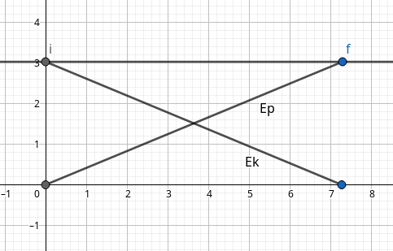

#### Per casa

Problema del pendolo semplice: FIlo di lunghezza $l$, viene lasciato il pendolo.

$\theta<<1$

1. Analisi delle forze
2. $\theta=\theta(t)$
3. scegliere $c_1,c_2$(Sistema di coordinate a piacere)
   1. $c_1=c_1(t),  {d_{c_1}\over d_t(t)}, v_1, a_1$
   2. $c_2=c_2(t) , {d_{c_2}\over d_t(t)}, v_2, a_2$

-----

---

## 11/03/2019

### Moto armonico

**Problema del pendolo: soluzione**

$\begin{cases}x=l\sin\theta \\y=-l\cos\theta  \end{cases}$

Dove $l $ è la lunghezza del filo.

Derivando in $d\over dt$ ottengo 

$\begin{cases} {dx(t)\over dt}=l\cos\theta {d\theta\over dt} \\{dy\over dt}=l\sin\theta {d\theta\over dt} \end{cases}$ riderivo in $d\over dt$ $\begin{cases} {d^2x\over dt^2}=l[-\sin\theta( {d\theta\over dt} )^2+\cos\theta {d^2\theta\over dt^2}]\\ {d^2y\over dt^2}=l[\cos\theta( {d\theta\over dt} )^2+\sin\theta {d^2\theta\over dt^2}]\end{cases}$

> nota bene che ${d^2x\over dt^2}\ne( {d\theta\over dt} )^2$

Ora per aiutarmi disegno un triangolo

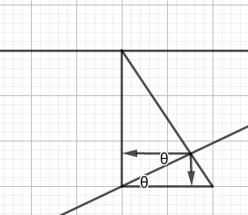

noto che formo due angoli $\theta$ coniugati interni!

Dunque ora, mettendo $\vec{R}=\vec{P}_{parallela}$ e $\vec{P}=\vec{F}_p$

$\begin{cases} R_x=-R\cos\theta = -P\sin\theta\cos\theta \\R_y=-R\sin\theta=-P\sin^2\theta\end{cases}$

$\vec{R}=\vec{F}=m{d^2\vec{r}\over dt^2} \Rightarrow\begin{cases}R_x=m{d^2x\over dt^2}\\R_y=m{d^2y\over dt^2}\end{cases}$

Proseguendo:

$\begin{cases}\bcancel{m}\cdot(-g)\sin\theta\cos\theta=\bcancel{m}\cdot l[-\sin\theta({d\theta\over dt})^2+\cos{d^2\theta\over dt^2}]\\\bcancel{m}\cdot(-g)\sin^2\theta=\bcancel{m}\cdot l[\cos\theta({d\theta\over dt})^2+\sin{d^2\theta\over dt^2}] \end{cases}$

Ora divido per $l$ e sposto tutto a sinistra

$\begin{cases} \cos\theta{d^2\theta\over dt^2}-\sin\theta({d\theta\over dt})^2+{g\over l}\sin\theta\cos\theta=0 \\\\sin\theta{d^2\theta\over dt^2}+\cos\theta({d\theta\over dt})^2+{g\over l}\sin^2\theta=0\end{cases}$

Ricordando l'espansione in serie di Taylor

> $\sin\epsilon\simeq\epsilon \ \ \ \ \epsilon\longrightarrow0$
>
> $\cos\epsilon\simeq1-{\epsilon^2\over2} \ \ \ \ \epsilon\longrightarrow0$
>
> $(1+\epsilon)^\alpha \simeq 1+\alpha\epsilon  \ \ \ \ \epsilon\longrightarrow0$

Sfrutto la prima espansione e sostituisco $sin \theta$ con $\theta$. Questa sostituzione è valida fintanto che le oscillazioni sono piccole.

$\begin{cases}\theta''-\theta(\theta')^2+{g\over l}\theta=0\\\theta\theta''+(\theta')^2+{g\over l}\theta^2=0\end{cases}$ ora moltiplico la seconda equazione per $\theta$ e ottengo $\begin{cases}\theta''-\theta(\theta')^2+{g\over l}\theta=0\\\theta^2\theta''+(\theta')^2\theta+{g\over l}\theta^3=0\end{cases}$

Effettuo una somma della prima equazione con la seconda ottenendo:

$(1+\theta^2)\theta''(1+\theta^2){g\over l}\theta=0$

$\theta"+{g\over l}\theta=0$  Si tratta di risolvere un'equazione differenziale.

#### Equazione differenziale armonica

> $x'' + cx=0$ con $c>0$

dove a è la **pulsazione al quadrato** del moto armonico. Ottengo la 

> **Pulsazione:** $\omega=\sqrt{c}$

Come soluzioni generali per un'equazione di questa forma abbiamo sempre 

$\begin{cases}\theta(t)=A\sin(\sqrt{c}t+B)\\ \theta'(t) = A \cos (\sqrt {c} t + B) \sqrt c \\ \theta''=-A\sin(\sqrt{c}t+B)c\end{cases}$

nell'esempio di prima otteniamo

$\begin{cases}\theta(t)=A\sin\sqrt{({g\over l})}t+B)\\\theta''=-A\sin(\sqrt{({g\over l})}t+B){g\over l}\end{cases}$

Dove A e B possono essere risolte imponendo le condizioni al contorno (problema di Cauchy):

$\begin{cases}\theta(0)=\theta_0\ (angolo\ iniziale)\\\theta'(0) = 0\ (velocità\ iniziale) \end{cases}$ 

Risolvendo il sistema risulta

$$\begin{cases}A = \theta_0 \\B={\pi\over2} \end{cases}$$

quindi la soluzione è $\theta(t)=\theta_0\sin(\sqrt{{g\over l}}+{\pi\over2})=\theta_0\cos(\sqrt{g\over l}t)$.

$\blacksquare$

Da questo esercizio possiamo capire come la pulsazione fosse

$\omega=\sqrt{g\over l}$

La maggior parte delle volte $c$ della equazione precedente sarà uguale a qualcosa tipo $\alpha\over\beta^2$

Abbiamo inoltre ottenuto che il **moto armonico è periodico.**

Avendo che

> **Periodo:** $T|\omega T=2\pi\Longrightarrow T={2\pi\over \omega}$
>
> Tempo tra due riproposizioni nello stesso atto di moto, cioè stesso spazio con la stessa velocità.
>
> Maggiore è la pulsazione più il periodo è **corto.**

Da notare che nell'esercizio del pendolo precedente **non ho considerato l'attrito, quindi ho continue oscillazioni**. Cioè il pendolo non si ferma e continua a oscillare fra l'angolo $\theta_0$ e l'angolo $-\theta_0$.

Da notare inoltre che la pulsazione dipende unicamente dalla lunghezza del filo del pendolo (oltre che dall'accelerazione di gravità).

> **Isocronia delle piccole oscillazioni:** Per angoli piccoli, maggiore spostamento **non significa** maggiore periodo.

### Forza Elastica

Una molla (ideale) se compressa o espansa rispetto alla posizione di riposo produce una forza "di richiamo" (che tende a farla tornare alla posizione di riposo) di intensità direttamente proporzionale alla lunghezza della compressione (o espansione). La costante di proporzionalità è detta _costante elastica della molla_.

> **Forza di richiamo(o Elastica):** $\vec{F}=-k\vec{x}$

#### Esercizio: Calcolo molla con piccole oscillazioni

$m=10kg$

$k=10^3 N/m$

$T=?$

$F=ma$

$-kx=m{d^2x\over dt^2}$

Ottengo

$x''+{k\over m}x=0$

che è l'equazione armonica!

quindi ora ottengo la pulsazione $\omega^2={k\over m} \Rightarrow \omega=\sqrt{k\over m}$

$T={2\pi\over\omega}=\sqrt{m\over k}=0,635$

**Periodo**

$W_{AB}=\int^0_x-ky(-dy)=-{1\over2}kx^2$

*Il meno è presente perchè vado da $x$ a zero.*

Noto che questo integrale è $\int^B_A\vec{F}\cdot d\vec{s}=\int^x_0 kxdx={1\over2}kx^2=-Ep$

#### Esercizio: Ciclista

Un ciclista va a 25 km/h (la velocità  costante)

La potenza che produce è $ P=150W$

Attrito $=?$ 

$v=25km/h={25\over3,6}m/s=6,9m/s$

$P={dw\over dt}=\vec{F}{d\vec{s}\over dt}$ Qui ho dovuto fare un trick poco matematico, **spostando il $dt$** sotto il $d\vec{s}$

$P_a=\vec{F}_a\cdot \vec{v}=-Av$

Sappiamo che $P_c=-P_a$

Abbiamo dunque che 

$P_c=Av$

$A={P_c\over v}=21,6 N\simeq 2Kg$ cioè è come se spingesse circa $2kg$

---

---

## 12/03/2019

#### Esercizio: Pendolo conico (massa puntiforme appesa a un filo che traccia una circonferenza sul piano)

$m=50g=50\cdot10^{-3}kg$

$\theta=?$

$tensionefilo=?$

$l=0,5m$

$f={1\over T}={1\over4}s^{-1}$

$\omega=2\pi f ={2\pi\over2}rad/s$

L'asse $z$ entra nella lavagna.

$m\omega^2R=F_c$

${R\over l}=\sin\theta$

$\theta=\arcsin({R\over l})$

$\omega^2 l\bcancel{\sin \theta}=g {\bcancel{\sin\theta}\over\cos\theta}$

$\theta=\arccos({g\over \omega^2 l})=\arccos({\bcancel{0,8}\over {\bcancel{\pi}^2\over 4}{1\over2}})$

La velocità angolare è troppo bassa per permettere all'oggetto di muoversi, quindi non ho un $\theta$

$0\le {g\over\omega^2l}\le 1$

$\omega^2\le{g\over l}|\omega\ge 4.5 rad/s$

$\lim_{w\to\infty} \theta(\omega)={\pi\over2}$

Per far arrivare ${g\over\omega^2l}$ a zero, avendo $g$ ed $ l$ che sono costanti, posso solo lavorare con $\omega$. Quindi per far si che sia zero, devo applicare il limite qui sopra con omega che va ad infinito.

#### Esercizio: Giro della morte

*nonleggoidatiallalavagna*

#### Esercizio: Terra

Ho la terra, con un raggio $R$ , una forza gravitazionale e $\theta$ è l'angolo che voglio calcolare per capire qual è il punto di distacco (e opzionalmente il punto di landing.)

---

### Termodinamica

> **Atomi**: Costituenti minimi della materia, sistemi aggregati composti da un nucleo e sistemi orbitali(elettroni).

Gli atomi sono a **carica neutra**, quindi gli elettroni hanno carica **negativa**, i protoni la hanno **positiva** e contraria agli elettroni(somma =0).

**Raggio** **nucleo** è dell'ordine alla $10^{-15}m$

**Raggio atomo**= $10^{-10}m$

**Raggio molecole**= $10^{-8}m$

**Nucleo**= Composto di nucleoni, cioè protoni e neutroni (particelle con carica neutra)

**Elettroni**: non riusciamo a calcolarne il raggio, troppo piccolo.

>**Numero di avogadro:**  $N_a=6,022 \cdot 10^{23}$

>**MOLE**: Quantità di sostanza che contiene esattamente un numero di Avogadro di componenti. misurata in $mol$.

> $1 mol=$ quantità di sostanza contenuta in $m=A$ grammi dell'elemento, dove $A$ è il **peso atomico**.

**Esempio**:
L'idrogeno ha peso atomico A=1, quindi una mole di $^1H$ è la quantità di sostanza contenuta in 1 grammo di idrogeno.

mentre

Il carbonio ha peso atomico A=12, quindi una mole di $^{12}C$ ha massa 12 grammi.

Avendo $H_2O$, ho una $A_{effettiva}=18$ cioè $1mol$ di $H_2O$ è la quantità di sostanza contenuta in 18g di $H_20$

Stati della materia:

* **Solido**: Un corpo solido ha una forma e un volume proprio.
* **Liquido**: Un liquido ha un volume proprio ma non ha forma: assume quella del recipiente.
* **Gassoso**: Un gas non ha né un volume né una forma propria, assume volume e forma del recipiente, si espande in tutto lo spazio disponibile.

#### Gas Ideale

Un gas è ideale (o anche "perfetto") se:

* non esistono forze di interazione fra le particelle;
* gli urti fra le particelle e con il recipiente sono perfettamente elastici, cioè l'energia cinetica della particella prima e dopo l'urto è conservata;
* Il moto delle particelle è assolutamente casuale.

#### Energia interna

> In un sistema gassoso, le molecole sono in costante movimento, avendo energia cinetica. Possiamo dire che il sistema ha un'**energia interna** e se il gas è perfetto (non ci sono altre interazioni), $E_{interna}=E_{cinetica} = U$

**Q:Cosa succede quando una particella tocca la parte del contenitore? **

*A: Rimbalza*

Il rimbalzo è calcolabile : $i$= iniziale; $f$=finale.

$\vec{p}_i=p_x \hat{x}+p_y\hat{y}$

$\vec{p}_{f}=-p_x\hat{x}+p_y\hat{y}$

$\Delta\vec{P}=\vec{P}_f-\vec{P}_i=-2p_i\hat{x}$

*Ma con il rimbalzo, non perdo energia?* No perchè è **perfettamente elastico** quindi non ho una perdita di energia. In generale, una pallina da tennis che rimbalza perde energia, perché ho una componente NON elastica che disperde energia in attriti.

**Q: Quante particelle ho in una zona gassosa che urtano il contenitore?**

*A:*

$N?$ 

$N_u$ numero di urti nel tempo $\Delta t$

$\mathcal{N}_u=N$ 

Attenzione, questo $\mathcal{N}_u$ vuol dire la quantità di urti in un determinato istante di tempo! 

Quindi è uguale al numero di particelle nel volume.

tutto ciò che ho dentro a quel contenitore sta urtando la parete in velocità $v_x$.

Se il gas è perfetto ed ideale, le particelle che urtano sono $N$.

$N=v\cdot n$ dove $n$ è la **densità volumica**($[n]=[{1\over L^3}]$).

Quindi otteniamo che

${N\over\Delta t}={nSL\over\Delta t}={nSv_x\bcancel{\Delta t}\over\bcancel{\Delta t}}=nSv_x$

$nSv_x\Delta t$ è il numero di urti che ho. 

In $\Delta t$ , ottengo che il numero di urti nella quantità di tempo è $nSv_x$.

*Avendo tutte la stessa velocità $v_x$ abbiamo che tutte andranno ad urtare la parete allo stesso momento, quindi ottengo la formula qui sopra.*

Tutte urtano l'oggetto perchè il nostro è un esperimento deterministico, muovendosi orizzontalmente, tutte che partono dalla stessa linea toccano allo stesso momento.

**Se ho particelle molto veloci, avrò più urti nel tempo.**

**Q:Ognuna di queste particelle, che impulso trasferisce alla parete?**

*A:*

$\Delta\mathcal{P}_x=\mathcal{N}_y\Delta p=n S v_x \Delta t(-2mv_x)$

dove l'ultima parte equivale a $-2nS\Delta t mv_x^2$

Ora noto che ho 

$F_x={\Delta\mathcal{P}_x\over\Delta t}=2nSmv_x^2$

**Osservo che**: Per ognuna delle pareti che considero, devo considerare tutte le particelle che hanno il rispettivo $v_x$ ma che vanno nella direzione giusta(con il segno giusto).

**Osservo che**: Posso considerare la velocità globale della particella, non ho la $v_x$ e $v_y$. Da $v_x$ devo passare a $v$.

**Osservo che**: $v_x$ è il valor medio delle v, cioè ammetto che ho delle variazioni.

Quindi passo da $v^2_x\to v^2$ attraverso il valor medio di $v$ cioè $<v_x^2>$

Ottengo che

$v^2=-nSm<v_x^2>$

$<v^2>=<v_x^2+v_y^2+v_z^2>=<v_x^2>+<v_y^2>+\dots$

Poichè ho scelto io il sistema di riferimento: $mv_x^2={1\over3}<v^2>$

$F_x={\Delta\mathcal{P}_x\over\Delta t}=2nSmv_x^2=-{N\over V}S{1\over3}<mv^2>$

>Ottenendo la formula della **pressione**:
>
$P={F\over S}=+{N\over V}{1\over 3}<mv^2>$

Quindi la pressione P nel nostro volume V è 

$PV=N {2\over 3}<{1\over2}mv^2>$

dove $<{1\over2}mv^2>$ è **energia cinetica media.**

----

---

## 22/03/2019

### Pressione

$[P]=[{F\over S}]$ dove F è **forza** e **S** è superficie, misurata in $Pa$ cioè **Pascal**

Quindi la definizione è

> $P={F\over S}$

Abbiamo che:

$1 bar=10^5 Pa$

$1 atm= 1,01325 bar= 1,01325\cdot 10^5 Pa$

In millimetri di mercurio

$1 mmHg | 1 atm=760mmHg$

Facendo un po' di esperimenti otteniamo che
>$PV=costante\ T$ 
>
>questo vale solo per gas molto rarefatti e poco reagenti(gas **ideali**) con **T misurata in Kelvin**.
>
>Se misurata in °C o °F non vale.

$costante \ = Rn$ dove $R$ è **indipendente dal gas considerato** e $n$ è **il numero di moli, la quantità di gas.**

Ricordando che $PV=nRT$

$[R]=[{PV\over nTe}]=[{F_{L^2}\cdot L^3 \over QTe}]=[{F\cdot L \over Q T_e}]=[{E\over QT_e}]$

Esempio:

*Ho 13 moli di azoto liquido, a quanti atomi corrispondono?*

Che sia liquido o meno poco ci interessa.

$N=n\cdot N_a$ dove $N_a$ è il numero di Avogadro e $n$ è il numero di moli.

otteniamo $nR=N{R\over N_a}=NK_b$

dove $K_b$ è la costante di Boltzmann.

#### Costante di Boltzmann
>$K_b={R\over N_a}={8,314 J/\cancel{mol}K)\over 6,022\cdot 10^{23} K/\cancel{mol}}=1,38\cdot 10^{-23}J/K$

#### Equazione di stato di gas perfetti
> $PV=nRT \iff PV=NK_bT$
>

Noto che la prima equazione la ottengo **sperimentalmente** mentre la seconda la ottengo **misurando.**

ora noto che $\begin{cases}PV={2\over3}N<E_k> \\ PV=NK_bT\end{cases} \to K_bT={2\over3}<E_k> $ e
$<E_k>={3\over2}K_bT=3\cdot{1\over2}K_bT$

**Il singolo componente del mio gas ha tre gradi di libertà in questo caso.**

Ora ottengo che

#### Energia interna media in un gas perfetto monoatomico

$U=E_i=^{monoatomico} N<E_k>$ (dove $<E_k>$ è l'energia cinetica media rispetto ad un grado di libertà)

> $u={U\over N}=^{n.a.}<E_k>$

#### Equipartizione dell'energia interna
> $u=L {K_bT\over 2}$ dove $L$ è il **numero di gradi di libertà**.

Vediamo dunque che dipende solo da $T$ temperatura e dal numero di gradi di libertà.

#### Esercizio moli

$L=3$

$n=3mol$

$V_i=831,4l$

$P=3 atm$

Trasformazione isobara

$V_f=2V_i$

$T_i,T_f,U_i,U_f=?$

$PV=nRT$

$T={PV\over nR}\to T_i={P_iV_i\over nR}={3\cdot1,015\cdot10^5Pa\cdot 8,314\cdot10^2\cdot10^{-3}m^3\over 3mol 8,314 {J\over mol\cdot K}}=10150 K$

$P={nRT\over V}\to {\cancel{nR}T_i\over V_i}={\cancel{nR}T_f\over V_f}\to {T_i\over V_i}={T_f\over 2V_i}\to T_f=2T_i=20300K$

Calcolando 

$U={3\over2}nRT$

$U_f=2U_i$ ed $U_i$ me lo calcolo.

#### Esercizio
$PV=cost\ t+A$

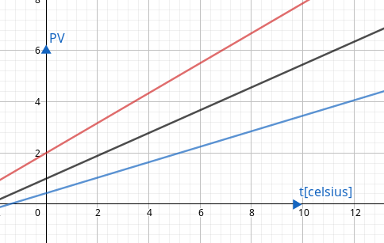

Noto che la temperatura minimia possibile non dipende dal gas.

Adatto una scala diversa, spostando la $y$ dove ho lo **zero assoluto**

> **Zero assoluto**: Zero kelvin sotto il quale non ha più senso parlare di termodinamica.
>
> $0 K = -273,15 °C$

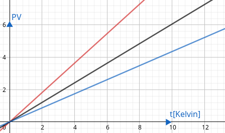

### Principi della termodinamica
Ho un ambiente che chiamo universo e un sistema con un energia interna $U$. Come avviene lo scambio di energia?

Ricordiamo **che quando si scalda, aumenta l'energia interna**.

L'energia può essere scambiata sotto forma di **calore** o di **lavoro**:

1. $W$ Lavoro:
   1. Ordinato;
   2. Coerente;
   3. Organizzato.
2. $Q$ Calore 
   1. Disordinato;
   2. Incoerente;
   3. Disorganizzato.
##### Esempio dei pistoni
Ho un recipiente chiuso le cui pareti sono rigide e adiabatiche, una parete può muoversi (è un pistone). Una forza preme sul pistone comprimendo il gas: compie un lavoro.

*Supponiamo che l'intensità della forza applicata sia costante e sufficiente a far muovere il pistone di una distanza $\Delta x$. Man mano che spingo, la pressione del gas esercitata sul pistone sarà maggiore, quindi si raggiungerà un equilibrio. Ignoriamo questo dettaglio.*

$W=\vec{F}_{ext}\cdot\Delta\vec{x}=F\Delta x>0$

Posso assumere che il lavoro esterno si tramuti tutto in variazione di energia interna: le pareti sono rigide, quindi il gas non può compiere lavoro, e sono adiabatiche, quindi il gas non può cedere calore all'esterno:

$W_{ext}=\Delta U$ cioè $U_i\to_{W_{ext}}U_f\Delta U=U_f-U_i=W_{ext}$

#### Calore

Se metto un oggetto al sole si "scalda", cioè aumenta la sua energia interna. Ma non ho lavoro, perchè **non ho spostamento**.

Quindo ho un trasferimento di energia **senza lavoro**. Questo è chiamato **CALORE**.

----

----

## 25/03/2019

#### Esercizio pistone
$\vec{F}_{tot}=\vec{0}$

$\vec{F}_{ext}+\vec{F}_{int}=0$

${\vec{F}_{ext}\over A}={\vec{F}_{int}\over A}\Rightarrow P_{ext}=P_{int}$

$\vec{F}_{ext}\cdot\Delta\vec{x}=F\Delta x= W_{ext}>0$

$W_{ext}=\Delta U=U_1-U_i>0$

La forza esterna va sempre pensata come la forza che **comprime/tenta di comprimere il gas**. Il volume si espande per un $\Delta x$, lentamente, la forza esterna prova a contrastarlo.

Il lavoro esterno, per questo motivo, sarà dunque **negativo**.

$\vec{F}_{ext}\cdot \Delta\vec{x}=-F\Delta x=W_{ext}<0$

$W_{ext}=\Delta U= U_f- U_i<0$

Assumiamo sempre che le due forze siano uguali e opposte

$W_{ext}=-W_{gas}$

Ottengo che

> $\Delta U_{gas}=-W_{gas}$

La variazione dell'energia interna è **opposta al lavoro compiuto  dal sistema!**

In generale, per trasformazioni senza scambio di calore, vale

> $\Delta U=-W$
> 
> Convenzionalmente diciamo che:
>
> * $W>0$  il lavoro è compiuto dal sistema e subito dall'ambiente, ad esempio, il pistone si espande;
> 
> * $W<0$ il lavoro è compiuto dall'ambiente, il sistema subisce il lavoro, ad esempio, il pistone viene compresso.
> 

L'energia interna di un sistema termodinamico dipende unicamente dalla temperatura (questo risultato sarà dimostrato più avanti),

#### Esercizio ruota bicicletta
$r_{ext}=25cm$

$r_{int}=23cm$

Tubolare

Ho un uomo con $m=100kg$

1. Calcolare il volume del tubo
2. Calcolare pressione all'interno quando l'uomo sale
3. Assumo che per gonfiare la ruota ho fatto 100 colpi di pompa dove, ad ogni colpo, mette $V^{20*C}=240cm^3$, a che temperatura ho la ruota quando sale?
4. Calcolare il lavoro per gonfiare la gomma.

#### Scatola con gas dentro
Ho una scatola rigida con gas dentro

* Espongo la scatola al sole, ho **radiazione luminosa**.
* **Non** conto una ipotetica riflessione, suppongo che la radiazione sia completamente assorbita dalla scatol.
* Fornisco energia all'oggetto, il volume non cambia.
* Ho $T_{gas}$ e $T_{ext}$(temperatura recipiente)

Se aspetto abbastanza ho un trasferimento di energià tra $T_{ext}$ e $T_{gas}$ tale che 

>$\Delta T+T_{ext}=T_{gas}$ 
>

Dove $\Delta T$ è la variazione di temperatura provocata dalle radiazioni.

>Ho un trasferimento di energia senza **lavoro meccanico**.
>

#### Calore
**Calore:** $\Delta U = Q$ 

Variazione di energia **senza lavoro meccanico**.

con:
* $Q>0$ se è ricevuto dal sistema
* $Q<0$ se è sottratto dal sistema.

Ricordiamo che noi trattiamo **sistemi in equilibrio**, quindi il contenitore e il gas all'interno raggiungono la stessa temperatura (aspettando abbastanza).

#### Primo principio della termodinamica
>$\Delta U=Q-W$
>
>Variazione di energia interna = Calore assorbito dal sistema - Lavoro compiuto dal sistema

### Modalità di trasferimento del calore

##### Conduzione

Atomi che "vibrano",  percepibile da tutti gli atomi vicini. Aumentando la vibrazione avrò un aumento della vibrazione indotta. 

La sua vibrazione **è l'energia media**, crea un'onda di calore.

La vibrazione viene trasmessa agli atomi vicini in modo "ammortizzato", cioè più debole, che a loro volta trasmetteranno ai loro vicini in modo più debole ancora, fino a quando sarà impercettibile. Questa vibrazione è il calore.

##### Convezione

Ho un fluido, con una zona del fluido più calda, spostandolo ad una zona più fredda il calore si "dissipa". 

Per esempio: in un sistema di raffreddamento a liquido, il liquido passa da freddo a caldo perchè viene fatto passare in zone dove il motore ha bisogno di rilasciare calore. Il calore viene passato al liquido, che viene fatto circolare fino a raggiungere una zona aperta all'ambiente, nel quale disperde il calore che aveva ottenuto tornando freddo.

##### Irraggiamento

A colpire il mio sistema è la **radiazione elettromagnetica**, cioè **energia pura**.

L'energia che viene assorbita fa in modo che l'oggetto vibri e si scaldi.

>**Riflessione:** Un fotone entra, l'atomo si eccita e si diseccita subito, rispedendo lo stesso fotone(dove in realtà è diverso ma ha la stessa energia).

#### Sistemi chiusi e isolati

Un sistema **chiuso** non permette lo scambio di materia con l'esterno (ma permette lo scambio di energia, sotto forma di calore o lavoro).

Un sistema **isolato** è un  sistema chiuso che inoltre non permette lo scambio di energia con l'ambiente (né sotto forma di calore, né sotto forma di lavoro).

Altri termini spesso usati: un sistema **adiabatico** è un sistema chiuso che non permette lo scambio di calore con l'esterno (permette comunque lo scambio di energia sotto forma di lavoro). Per indicare che un sistema chiuso (ad esempio un recipiente) non permette lo scambio di energia sotto forma di lavoro si dice essere **rigido**.

#### Esempio sistema isolato

Ho un sistema isolato con un pendolo dentro.

Se torno dopo anni avendo dato una spinta al pendolo e ho del gas dentro, il pendolo sarà fermo(attrito).
Per definizione di sistema isolato, se $U_i$ è energia interna iniziale e $U_f$ energia interna finale:

$\begin{cases} Q=0 \\ W=0 \end{cases}  \Delta U=0 \Longrightarrow U_f= U_i$
ma quindi otteniamo che	

$\begin{cases}U_i=U_i^{pendolo}+U_i^{gas}\\U_f= \bcancel{U_f^{pendolo}}+U_f^{gas}\end{cases}$

abbiamo che $ \bcancel{U_f^{pendolo}}$ perchè $U_f^{pendolo}=0$ visto che il pendolo è **fermo** a fine esperimento (ignoriamo l'energia interna dei corpi facenti parte del pendolo).

Otteniamo dunque:

> $U_f^{gas}= U_i^{pendolo}+U_i^{gas} \\ U_f^{gas}-U_i^{gas}=\Delta U^{gas}=U_i^{pendolo} \\ \text{Con}\ \Delta T ^{gas}>0 \text{e } T_f^{gas}>T_i ^{gas}$

Ottengo delle osservazioni importanti:

1.  $U$ finale del gas è la $U$ iniziale del pendolo $+$ la $U$ iniziale del gas. L'energia iniziale del pendolo è stata spesa per aumentare l'energia interna del gas.
2.  $U$ del pendolo iniziale è dunque $\Delta U_{gas}$.
3.  Il trasferimento di energia nell'altra direzione non funziona:*se vario la temperatura del gas il pendolo non si muove, perché il gas si scalda in modo disordinato, non solo da un lato.*
4.  In questo senso, il calore è "disorganizzato", mentre il lavoro è "organizzato".

#### Trasformazioni

##### Trasformazione isocora

$\Delta V=0 \Rightarrow W=0$ (volume non varia, non ho un lavoro che ci agisce)

$\Delta U=Q$ 

##### Trasformazione adiabatica

$Q=0$ (calore non varia)

$\Delta U=-W$

##### Trasformazione isotermica

$\Delta T=0 \Rightarrow \Delta U=0 \iff Q=W $ con $Q>0, W>0$ (temperatura non cambia)

#### Capacità termica

Se fornisco calore a un sistema (non necessariamente un gas) questo aumenta la sua temperatura. La costante di proporzionalità fra calore e differenza di temperatura caratteristica di un sistema è detta **capacità termica**.

$Q= \mathfrak{c} \cdot \Delta T \Longrightarrow \mathfrak{c}\stackrel{def}{=} \frac{Q}{\Delta T}$ 

>La capacità termica è **il variare del calore in relazione alla variazione di temperatura** per un certo sistema
>

Come **unità di misura** ha  $\mathfrak{c} ={1J \over 1K}$

*Un buon piumino ha una **alta capacità termica**, mentre un fondo di pentola ha una **bassa capacità termica***.

Osserviamo anche che

>Più massa $=$ Maggiore capacità termica. 

nello specifico, consideriamo due sistemi composti dello stesso materiale. Se il primo ha massa doppia rispetto al secondo, ha anche capacità termica doppia.

#### Calore specifico

Di due tipi:

1. **Calore specifico (capacità termica per unità di massa)**$= c = {\mathfrak{c}\over m}= {1\over m}\cdot {Q\over \Delta T } $
   
   *Unità di misura*$={J\over Kg \cdot K}$
2. **Calore specifico molare (capacità termica per mole)**$= c={\mathfrak{c}\over n}={1\over n}\cdot {Q\over \Delta T} $
   
   *Unità di misura*$={J\over mol\cdot K}$

#### Esperimento di Joule

L'esperimento di Joule mostra l'equivalenza fra lavoro e calore.

Joule costruisce un mulinello immerso in acqua, contenuto all'interno di un recipiente adiabatico e azionato da corpi collegati al mulinello che vengono lasciati cadere verso Terra. Ignorando gli attriti delle pulegge, l'energia meccanica persa dai corpi che cadono è assorbita dall'acqua, attraverso il mulinello che la agita. Il lavoro dei corpi che cadono è convertito interamente in calore assorbito dall'acqua; noto il lavoro compiuto e la variazione di temperatura dell'acqua è anche possibile misurare il calore specifico dell'acqua.

$W=mgh$

$W_{h_2O}=0$

$\Delta U=Q$ (1 principio termodinamica)

A pressione $p=1 atm$, per ottenere una variazione di temperatura $14,5 ^{\circ}\mathrm{C}\to 15,5 ^{\circ}\mathrm{C}$  devo applicare un lavoro $W_G=4,186 kJ$

Otteniamo dunque il valore di una **caloria**

> $1 cal= 4,186J$
> 

$C_{H_2O}$ liquido$= {1kcal\over 1Kg\cdot 1K}=4,186 {kJ\over KgK}$

Ricordiamo che

$\Delta T=1K=\Delta T= 1^{\circ}\mathrm{C}$
##### Esempio pozzanghera

Ho una pozzanghera quadrata con uno strato di nylon sopra(ininfluente, serve solo per evitare l'evaporazione)

sappiamo che 

$W_{sole}=700W/m^2$

La pozzanghera è lunga e larga $50cm$ e profonda $1cm$

$T_i=20^{\circ}\mathrm{c}$

$\Delta t=8 hr$

$T_f=?$ 

Quale sarà la temperatura finale della pozzanghera se il sole apparisse istantaneamente(e non lentamente) per 8 ore? Supponiamo $\Delta U = Q $.

$W_{sole}\Delta t=Q= mc\cdot\Delta T$ cioè  il calore immesso dal sole per irraggiamento nel tempo.

$SW_{sole}\Delta t=mc \Delta T$

*è importante ricordare che devo considerare la superficie, anche se vedremo che sarà ininfluente.*

$\Delta T={SW_{sole}\Delta t S\over mc}={W_{sole}\Delta t S\over \rho V c}={W_{sole}\Delta t \bcancel{L^2}\over \rho \bcancel{L^2} h c}$

Ora abbiamo dunque

${7\cdot10^2\cdot2,9\cdot10^4\over10^3\cdot 10^{-2}\cdot4,19\cdot10^3}K=5\cdot10^2=500K$

è dunque aumentata di 500 Kelvin.

Ma se fosse davvero aumentata di 500K l'acqua sarebbe evaporata. Dobbiamo anche considerare il **calore latente**!

#### Calore latente

Affinché le trasformazioni di stato avvengano è necessario fornire energia al sistema, questo prende il nome di **calore latente**. L'energia posseduta dall'acqua (liquida) a 100°C non è la stessa del vapore d'acqua a 100°C: per trasformare l'acqua in vapore devo fornire altro calore, che non fa aumentare la temperatura ma aumenta comunque l'energia interna del sistema (e provoca il cambiamento di stato).

$Q=\lambda m$

>$\lambda$= Calore latente.

Si misura in $J/Kg$.

$\Delta T_{Cambio\ di\ stato}=0$

#### Stati della materia

SOLIDO $\xrightarrow[\xleftarrow{\text{Solidificazione}}]{\text{Fusione}}$ LIQUIDO $\xrightarrow[\xleftarrow{\text{Condensazione}}]{\text{Evaporazione}}$ VAPORE

Per $H_2O$, i calori latenti di fusione ed evaporazione sono i seguenti:

$\lambda _{SL}=3,3\cdot 10^5 J/Kg$ dove $SL$ sta per *Solido Liquido*.

$\lambda _{LV}=2,7\cdot 10^7 J/Kg$ dove $LV$ sta per*Liquido Vapore*.

#### Per casa
1. Ripetere esercizio precedente(della pozzanghera ) rimuovendo lo strato di nylon.
2. Ho $2kg$ di ghiaccio a $-10^{\circ}\mathrm{c}$ 
   3. Disegnare il grafico Temperatura/Calore (Temperatura asse $y$, Calore asse $x$)

   4. Disegnare il grafico Temperatura/ tempo (Temperatura asse $y$, tempo asse $x$)

     Aggiungendo che ${Q\over \Delta T}=100 cal/hr$.

----

----

## 29/03/2019

Ho un sistema e due corpi:

$m_1,c_1,T_1$

$m_2,c_2,T_2$

(c è la capacità termica)

Quando i due corpi sono a contatto ho uno **scambio di calore**.

$Q_1+Q_2=0$ perchè il calore che scambia con l'esterno è zero! $Q_{tot}=0$

Per la definizione di calore specifico, $Q_1=m_1c_1(T_f-T_1) \\Q_2=m_2c_2(T_f-T_2)$

Sommandoli, ottengo 

$Q_1+Q_2=m_1c_1(T_f-T_1)+m_2c_2(T_f-T_2) \\ \ \ \  \ \ \ 0\ \ \ \ \  \ \ =(m_1c_1+m_2c_2)T_f-(m_1c_1T_1+m_2c_2T_2)$

$T_f={m_1c_1T_1+m_2c_2T_2\over m_1c_1+m_2c_2}$

In generale

$T_f={\mathfrak{c}_1T_1+\mathfrak{c}_2T_2\over\mathfrak{c}_1+\mathfrak{c}_2}$

*Vuoto: Non ho molecole.*

#### Esercizio
$m_1=30g$

$t_1=-15^{\circ}\mathrm{c}$

$m_2=50g$

$t_2=60 ^{\circ}\mathrm{c}$

$T_e=?$

traduciamo i dati in una forma utilizzabile

$t_{1_k}=T_1=258K$

$t_{2_k}=T_2=333K$

$\lambda_{H_2O}=3,3\cdot10^5 J/Kg$

$c_{H_2O}={1kcal\over Kg\cdot K}=4,19 KJ/Kg\cdot K$

$Q_1=m_1c_1\cdot(T_f-T_1) \\ Q_2=m_2c_2\cdot(T_f-T_2)$

sommandoli

$Q_1+Q_2=(m_1\cdot c_1+m_2\cdot c_2)\cdot T_f-(m_1\cdot c_1\cdot T_1 + m_2\cdot c_2\cdot T_2)$

$T_f={m_1c_1T_1+m_2c_2T_2\over m_1c_1+m_2c_2}$

$Q_{fus}=\lambda_{H_2O}\cdot m_1=10^4 J$

$Q_{ghiaccio}=m_1\cdot c_1\cdot (T_{fus}-T_1)=900J$

$Q_{Acqua}^{(max)}=m_2\cdot c_2(T_{fus}-T_2)=-1,26\cdot 10^4 J$

Il resto è un tentativo di uno studente.

Trovo il calore dell'acqua dopo che il ghiaccio si è sciolto

$Q^{res}_{H_2O}=1,7\cdot10^3 J$

$Q^{res}_{H_2O}=m_2\cdot c_2(T_*-T_{fus}=1,7\cdot10^3 J=30g\cdot 4,19 KJ/Kg\cdot K\cdot (t_*-0^{\circ}\mathrm{c})$

${1,7\cdot10^3 J Kg^{\circ}\mathrm{c}\over 50g\cdot 4,19 KJ}=t_*=0,85\cdot 10^{\circ}\mathrm{c}=8,5^{\circ}\mathrm{c}$

$Teq={m_1\cdot c_1 T_1+m_2 c_2 T_2\over m_1c_1+m_2c_2}={30g\cdot273K+50g+281,5 K\over 80 g}=278,3K=5^{\circ}\mathrm{c}$

## 01/04/2019

$\vec{F}_{ext}=\vec{0}\Rightarrow {d\vec{P}t\over dt}=\vec{0}\Rightarrow \vec{P}_{tot}=\vec{const}\Rightarrow \vec{P}_{tot}$

ottenendo

$\vec{P}_{tot}^{iniziale}=\vec{P}_{tot}^{finale}$
Quindi otteniamo che
> Se niente perturba il moto del sistema, **la quantità di moto totale si conserva**.
> 

In altre parole
$\sum ^N_{i=1}\vec{P}_i(iniziale)=\sum ^M_{j=1}\vec{P}_i(finale)$

Noto che $N$ e $M$ non sono necessariamente uguali(non necessariamente stesso numero), vale anche per $i$ e $j$(non necessariamente stesso corpo).

### Centro di massa
>$\vec{x}_{CM}=\frac{{m_1}\vec{x}_1+m_2 \vec{x}_2}{ m_1+m_2}$
>Punto che **meglio approssima** *l'equilibrio del sistema.*

In una dimensione, tolgo semplicemente i vettori.

#### Esempio: Calcolo del centro di massa del sistema Sole - Terra

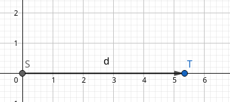

Ho il Sole, che indicheremo con $_s$ e terra che indicheremo con $_T$

$m_s=2\cdot 10^{30}Kg$

$m_T=6\cdot 10^{24}Kg$

$d=1,5\cdot 10^{11}m$ cioè la distanza tra la terra e il sole.

Calcolo $r$:

$r_{CM}={M_s x_s+m_T x_T\over m_s+m_T}={m_T\over m_s c_1+{m_T\over m_s}}$

Dove ${m_T\over m_s}=\epsilon \simeq 10^{-6}$

$x_T={m_T\over m_s}(1-{m_T\over m_s})$

ottenendo 

$r_{CM}=3\cdot10^{-6}\cdot1,5\cdot10^{11}m=4,5\cdot10^5m=450km$

#### Esempio raggio sole
Avendo il raggio della terra 

$R_T\simeq 6,4\cdot10^3m$

quanto sarà il raggio del sole?

$R_s=?$

Lo ottengo.

Il sole è circa $0,5^\circ$ di inclinazione rispetto alla terra, cioè $8,5 millirad$, ($1 ^\circ=17millirad$)

$d\tan{\phi\over 2}=R$

$d\cdot 4,2\cdot 10^{-3}=R$

$1,5\cdot 10^{11}\cdot 4,2\cdot 10^{-3}=R$

$6,3\cdot 10^8 m= R$

$R=630000km$ Raggio del sole.

#### Utili da sapere per esame

Se $\epsilon <<$ (molto piccolo) allora vale

* ${1+\epsilon}^{\alpha}=1+\alpha\epsilon$
* $\tan\epsilon=\sin\epsilon=\epsilon$
* $\cos\epsilon=1-{\epsilon^2\over2}$
* $\ln(1+\epsilon)=\epsilon$
* $e^\epsilon=1+\epsilon$

Praticamente limiti che tendono a zero.

#### Esempio su Aereo

Ho un aereo privato

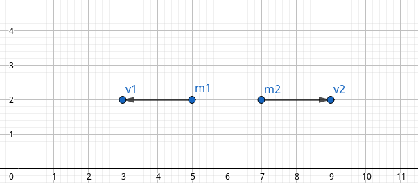

Definiamo $v_2-v_1$ come la differenza tra le due frecce.

Posso affermare che la lunghezza nella prossima immagine sarebbe equivalente se non fosse per $v_1$ che si oppone al nostro "aereo".

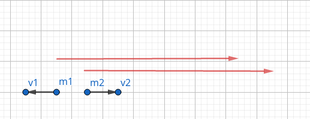

Ora avendo $i$ che varia tra $1$ e $2$

ottengo 

$\vec{v_i}'={d\vec{x}_i\over dt}={d\over dt}(\vec{x}_i-\vec{x}_{CM})={d\vec{x}_i\over dt}-{d\vec{x}_{CM}\over dt}$
dove ${d\vec{x}_i\over dt}=\vec{v}_i$ e ${d\vec{x}_{CM}\over dt}=\vec{v}_{CM}$

Ma noto che tutto ciò è **energia cinetica**

$E_k=\sum^n_{i=1}{1\over2}m_i \vec{v}_i^2$

$E_k=\sum^n_{i=1}{1\over2}m_i \vec{v}_i^2=\sum^n_{i=1}{1\over2}m_i(\vec{v}_i-\vec{v}_{CM})^2=\sum^n_{i=1}{1\over2}m_i(\vec{v}_i^2+\vec{v}_{CM}^2-2\cdot\vec{v}_i\vec{v}_{CM})=$

$=\sum^n_{i=1}{1\over2}m_i v_i+ \sum^n_{i=1}{1\over2}m_iv_{CM}^2-(\sum^n_{i=1} m_i\vec{v}_i)\vec{v}_{CM}$

Ottenendo

$\begin{cases}E_k=\sum^n_{i=1} {1\over2} m_i \vec{v}_i^2 \\ E_k'=E_k {1\over2}Mv^2_{CM}-\vec{v}_{CM}\cdot\sum m_i\cdot \vec{v}_i\end{cases}$

>Cioè che possiamo **cambiare il sistema di riferimento senza variare il risultato**(anche se l'energia cinetica varia!)

#### La quantità di moto si conserva
$\vec{x}_{CM}=\vec{0}$

$m_1 \vec{v}_1+m_2\vec{v}_2=\vec{0}$

Ora derivo in base al tempo

$m_1\vec{v}_1+m_2\vec{v}_2=\vec{0}$
cioè $\vec{P}_1+\vec{P}_2=\vec{0}$

Ottengo

>$\Delta \vec{P}_{tot}=\vec{0}$, cioè la **quantità di moto** si conserva nell'urto!
>

#### Esperimento barra
ho una barra, con due masse sopra all'estremità.
La barra è su un materiale che non ha attrito.

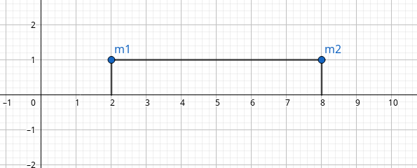
Immaginiamo che la barra "scorra" verso una direzione, facendo impattare le due masse.

$x_{CM}={m_1x_1+m_2x_2\over m_1+m_2}={m_2\over m_1+m_2}={d\over 2}$

$(m_1+m_2) {d\cdot x_{CM}\over dt}=m_1\cdot{dx_1\over dt}+{m_2x_2\over dt}=$

$=m_1v_1+m_2v_2=P_1+P_2=P_{tot}=0$
ottengo che
> Se due masse impattano, **non avendo forze esterne**, il centro di massa **rimane nello stesso punto**. 
> In questo caso, il centro di massa rimane a metà della barra.

$x_{1}^{Finale}-x_{2}^{Finale}={d\over2}$

$x_{CM}^{Finale}={m_1x_1^{Finale}+m_2x_{2}^{Finale}\over m_1+m_2}={m_1x_{1}^{Finale}+m_2(x_{1}^{Finale}-{d\over2})\over m_1+m_2}=x_{CM}^{Iniziale}={m_2\over m_1+m_2}\cdot {d\over2}$

Concludendo

$(m_1+m_2)x_1^{Finale}=m_2\cdot d$

$x_1^{Finale}={m_2\over m_1+m_2}\cdot d$
#### Urto perfettamente anaelastico
> Definisco **urto perfettamente anaelastico** quando due masse, in un urto si "attaccano".
> 

**Esercizio**
Avendo un pendolo balistico

$\Delta \vec{P}_{tot}=0$ 

$\vec{P}_{iniziale}=\vec{P}_{finale}$

$m_1\vec{v}_1^{iniziale}+m_2\vec{v}_2^{iniziale}=(m_1+m_2)\cdot \vec{v}^{finale}$

$\vec{v}^{finale}={m_i \vec{v}_i^{iniziale}m_2\vec{v}_2\over m_1+m_2}\xrightarrow[{m_b}]{{v_b}}$

Più in specifico 

Ho un proiettile sparato verso un sacco di sabbia. Si comporterà come un pendolo.

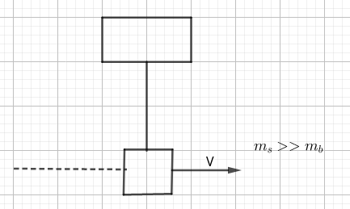

Il movimento sarà

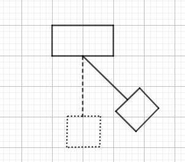

$M=m_s+m_b$ 

$m_bV_b+m_s\bcancel{V_s}=MV$

Il sacco essenzo fermo all'inizio abbiamo $V_s=0$

ottengo

$h=l-l\cos\phi$ dove $l$ è la lunghezza del cavo.

$Mgh={1\over2}\bcancel{M}V^2\iff V=\sqrt{2gh}$

$V=\sqrt{2gh}=\sqrt{2gl2\sin^2{\phi\over2}}=2\sin{\phi\over2}\sqrt{gl}$

Utilizzando la formula di bisezione $\sin{\phi\over2}=\pm \sqrt{1-\cos\phi\over2}$

Ottengo dunque 

$V_b={m_b+m_s\over m_b}2\sin{\phi\over2}\sqrt{gl}={m_b+m_s\over m_b}{\phi}\sqrt{gl}={m_s\over m_b} \phi\sqrt{gl}$

#### Esperienza di Joule (Espansione Libera)
Ho un contenitore:
* Pareti rigide e adiabatiche(non ho scambio di calore con l'esterno);
* Quantità di gas(moli) all'interno di un gas ideale all'interno di un comparto;
* Ho setto apribile e chiudibile tipo rubinetto.

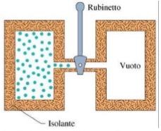

>Otteniamo che il gas si espande (espansione libera) e **non fa ne subisce lavoro!**
>Non ho scambio di calore con l'esterno!

L'energia interna del sistema non cambia per il primo principio della termodinamica.

$\begin{cases}dW=0\\dQ=0\end{cases}{ dV=0,dT=0}=U=U(t)$

Dove $dt=0$ è stato ottenuto **sperimentalmente**.

A Volume costante(isocora):

$dV=0\ \  dW=pdV=0$

$dQ=nc_vdT$ con $c_v$ calore specifico;

$dQ=dV$

ottengo
> $dU=nc_vdT\Leftarrow$ Vale sempre. 
> $\Delta U=nc_v\Delta T$

**La temperatura del gas non cambia!**
Quindi:
> $U$ dipende **solo** da $T$.

## 05/04/2019

Sospensione lezioni per prove intermedie

## 08/04/2019
#### Calore Specifico in base al processo
Abbiamo un grafico che descrive andamento di 3 gas.

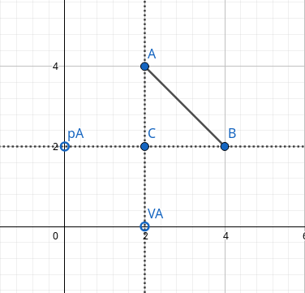

$\begin{cases}\Delta U=0 \\ \Delta T=0\end{cases}\Rightarrow U=U(T)$

$pV=mRT$ perchè ho un gas ideale.

Il punto A è composto da $p_A,V_A,T_A$

Il punto B è composto da $p_B,V_B,T_B$

Il punto C è composto da $p_C,V_C,T_C$

${p_A V_A\over nR}=T_A$

$p_AV_A=nRT_A$ dove $R \text{ e } T_A$ sono costanti.

$\Delta U= U_C-U_A=?$

Riprendo il calore specifico molare: $c={1\over n}{dQ\over dT}$, 
>ho un calore specifico che dipende dal processo considerato: $c_{proc}={1\over n}[{dq\over dT}]_{proc}$

Ciò significa che una espansione **isoterma** crea un differente $c_{proc}$ di una espansione **isocora.**

$\Delta U=U_B-U_A=(U_B-U_C)+(U_C-U_A)=\Delta U_{BC}-\Delta U_{CA}$

$A\to C: dU=dQ-\xcancel{dW}$($\xcancel{dW}$ perchè isocora).

Quindi: $dV=dQ=nc_VdT$

Uso $V$ perchè ho il **volume costante**.

Ottengo

$dQ_{p_R}=nc_{p_R}dT$.

Riprendendo:

$nc_VdT\xrightarrow[{c_V=\text{costante}}]{}\Delta U_{CA}=nc_V\Delta T=nc_V(T_C-T_A)$

$C\to B:_{Isoterma} dU=\xcancel{dQ}-dW$ ma posso affermare che

$\to \Delta U_{CB}=U(T_B)-U(T_C)=0$ con $T_B$ temperatura **finale** e $T_C$ temperatura **inziale**.

> $\Delta U= \Delta U_{BC}+\Delta U_{CA}=$ $nc_V\Delta T\\nc_V(T_C-T_A)$

dunque ottengo che con i gas ideali possiamo usare ciò.

> $\Delta U$ è proporzionale a $c_V$ e **non** dipende dalle trasformazioni, **vale sempre**.

### Relazione di Mayer

ho una isobara ($p $ costante)

$dV=dQ-dW\\nc_VdT=nc_VdT-pdV$

$pV=nRT$

$d[pV]=d[nRT]$

otteniamo 
>**Differenziazione equazione di stato di gas perfetti**:$Vdp+pdV=nRdT$

Tornando a $pV=nRT$

$nRdT-\xcancel{Vdp}$($\xcancel{Vdp}$ perchè la pressione è costante!)

$=n(c_P-c_V)dT$ cioè

> **Relazione di mayer:**$c_P-c_V=R$

Continuando abbiamo che 
>$R>0\iff c_P-c_V>0 \iff c_P>c_V$ 

Per i diversi tipi di gas abbiamo:
1. **Gas Monoatomici**
$c_V={3\over2}R\Rightarrow c_P={5\over2}R$
2. **Gas Biatomici**
$c_V={5\over2}R\Rightarrow c_P={7\over2}R$
3. **Gas Poliatomici**
$c_{p}/R=a+bT+cT^2$

### Grafici p V 
Ricordiamo che una *adiabatica non ha scambio di calore con l'esterno.* $Q=0\\\Delta Q=0$

Per il primo principio della termodinamica abbiamo che:

$dV=\xcancel{dQ}-dW$

$nc_vdT=-pdV$

Ricapitolando:
* **Isocora** $V=\text{Costante}$
* **Isobara** $p=\text{Costante}$
* **Isoterma** $T=\text{Costante}$

ed una adiabatica come si comporta ?

$n(c_P-R)dT=-pdV$

$nc_PdT=nRdT-pdV$

$nRdT=pdV+Vdp$

$-Vdp=pdV-nRdT$

$nc_PdT=Vdp$

Ora unisco $nc_PdT=Vdp$ con $nc_vdT=-pdV$ ottenendo(il primo sopra il secondo sotto frazione)
${{nc_PdT\over nc_vdT}=-{Vdp\over pdV}}$

ho dunque ottenuto 

$\gamma={c_P\over c_V}={dp/p\over dV/V}>1$ cioè $-{1\over\gamma}{dp\over p}={dV\over V} \Rightarrow \int-{1\over\gamma}d[\ln p]=\int d[\ln V]$

ottengo

$-{1\over\gamma}\ln[{p_{finale}\over p_{iniziale}}]-\ln[{V_{finale}\over V_{iniziale}}]$

> $pV_{iniziale}\gamma=p_{finale}V_{finale}\gamma\to pV^{\gamma-1 }=\text{costante}$
> $Tp^{1-\gamma\over\gamma}=\text{costante}$

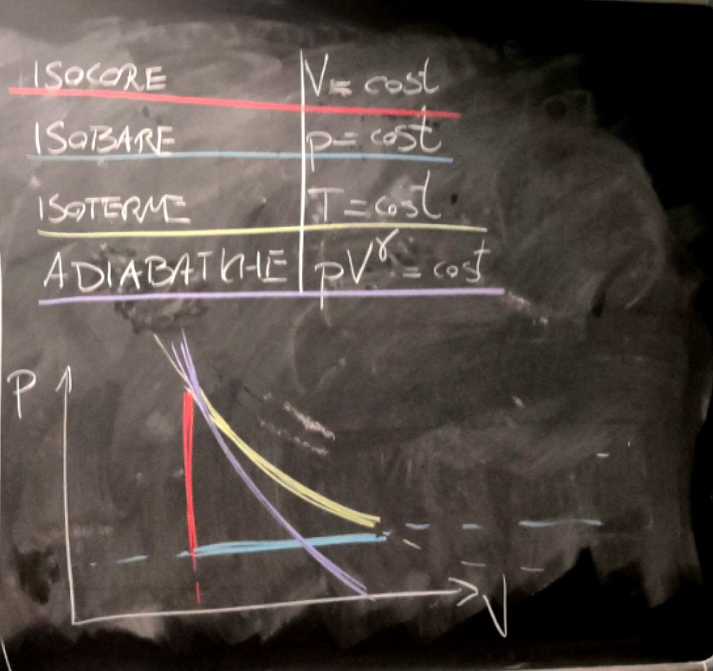

abbiamo dunque che
* **Isocora** $V=\text{Costante}$
* **Isobara** $p=\text{Costante}$
* **Isoterma** $T=\text{Costante}$
* **Adiabatica** $pV^{\gamma }=\text{Costante}$

In tabella otteniamo

|    Tipo     |     $dU$      |     $dQ$      |     $dW$      |
| :---------: | :-----------: | :-----------: | :-----------: |
|   Isocore   |   $nc_VdT$    |   $nc_VdT$    | $\varnothing$ |
|   Isobare   |   $nc_VdT$    |   $nc_pdT$    |    $-nRdT$    |
|  Isoterme   | $\varnothing$ |     $pdV$     |     $pdV$     |
| Adiabatiche |   $nc_VdT$    | $\varnothing$ |   $-nc_VdT$   |

### Cicli Termodinamici
> Un **Ciclo Termodinamico** avviene quando lo stato **iniziale** **coincide** con lo stato **finale**.

Possiamo anche dire che($i$ per iniziale e $f$ per finale)

$U_i=U_f\Rightarrow \Delta U=0$

$p_i=p_f$

$V_i=V_f$

$T_i=T_f$

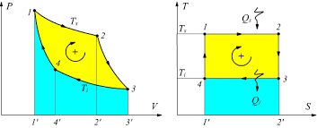

In questo esempio abbiamo l'area sottostante di colore azzurro, mentre l'area sovrastante in colore giallo.
Noi consideriamo $W_{superiore}$ come l'area sottesa della zona superiore, quindi area azzurra+area gialla.

Consideriamo $W_{inferiore}$ come l'area sottesa alla parte inferiore, quindi l'area azzurrina.
$W_{superiore}+W_{inferiore}=W$

>Per determinare il **segno di w**, ho bisogno dei segni di $W_{superiore}$ e di $W_{inferiore}$. Per vedere se è **compiuto o subito** ho bisogno del **verso di percorrenza**.

Affermiamo che 
$|W_{superiore}|>|W_{Inferiore}|$ 
$\begin{cases}W_{superiore}>0\\W_{inferiore}<0 \end{cases}$ allora $W>0$, senso **orario**.

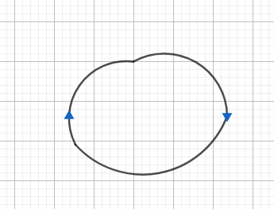

$\begin{cases}W_{superiore}<0\\W_{inferiore}>0 \end{cases}$ allora $W<0$, senso **antiorario**.

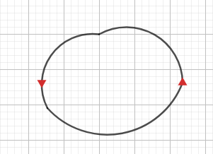

Un ciclo non compie lavoro quando ha una linea unica senza area all'interno.

$\Delta U= Q-W$

$Q=W$

Tutto il lavoro che fa la da come **calore**.

#### Cliclo termico/Macchina termica
$W>0\Rightarrow Q>0$
#### Ciclo frigorifero/Macchina frigorifera
$W<0\Rightarrow Q<0$
#### Calore ceduto e calore assorbito
$Q_A=$ Somma di tutti i calori assorbiti, quindi $Q_A>0$.
$Q_C=$ Somma di tutti i calori ceduti, quindi $Q_C<0$.
#### Lavoro subito e lavoro  effettuato
$W_F=$ Somma di tutti i lavori effettuati, quindi $W_F>0$.
$W_S=$ Somma di tutti i lavori subiti, quindi $W_S<0$.

Ciò mi porta a 
> $Q=Q_A+Q_C$
> $Q=W$
> $Q_A+Q_C=W_F+W_S$
> $W=W_F+W_S$

#### Rendimento di una macchina termica
> **Il lavoro/Calore assorbito** $={W\over c_A}=\eta={Q_A+Q_C\over Q_A}=1+{Q_C\over Q_A}=1-{|Q_C|\over Q_A}$ e ciò **vale per tutte le macchine termiche.**

#### Reversibilità di una trasformazione

>Una trasformazione è reversibile se, qualsiasi sia il dettaglio, vedo una serie di **stati di equilibrio**.
Uno stato di equilibrio di esempio, per un gas ideale: $pVnRT$ per ogni punto.

#### Ciclo di Carnot

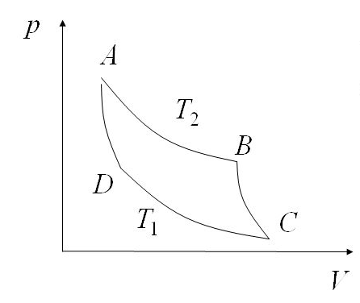
$AB=T_2>T_1$
$W>0$ perchè **orario**.

Avendo il seguente ciclo possiamo affermare che:
* $AB$ è una **espansione reversibile isoterma**;
* $BC$ è una **espansione reversibile adiabatica**;
* $CD$ è una **compressione reversibile isoterma**;
* $DA$ è una **compressione reversibile adiabatica**. 

>Sperimentalmente notiamo che $0\le \eta <1$

## 12/04/2019
Ho due sorgenti a temperature $T_2$ e $T_1$

Potrei connetterle con delle isocore, ma non lo faccio perchè avrei **scambio di calore**. Voglio che ci sia scambio di calore **nullo**, quindi utilizzo delle **adiabatiche** per collegare le due sorgenti.

Immagino di avere un pistone, rappresentato come punto $A$ che deve arrivare ad uno stato $B$

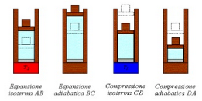

Ho che

$A \xrightarrow{\Delta U=0 ,Q=W}{}B \xrightarrow{\Delta U=-W ,Q=0}C \xrightarrow{\Delta U=0 ,Q=W}D$

Nel passo $A$ abbiamo calore $Q_I$ ceduto dalla sorgente $T_2$ 

Nel passo $B$ abbiamo lavoro $W_1$ compiuto.

Nel passo $C$ abbiamo calore $Q_1$ ceduto alla sorgente $T_1$ 

Nel passo $D$ abbiamo lavoro $W_{II}$ subito.

Abbiamo che

$Q_2=nRT_2\ln({V_B\over V_A})$(questo è così perchè $Q_2=W_2=\int^B_A pdV$)

$T_2V_B^{\gamma-1}=T_1V_C^{\gamma-1}$

$W_{I}=-\Delta U_{BC}=nc_V(T_2-T_1)$

$T_2V_B^{\gamma-1}$ è associabile a $B$ mentre $T_1V_C^{\gamma-1}$ è associabile a $C$

$Q_1=nRT_1\ln({V_D\over V_C})$

$T_1 V_D^{\gamma-1}=T_2 V_A^{\gamma-1}$

$W_{II}=-\Delta U_{DA}=nc_V(T_1-T_2)$

$T_1 V_D^{\gamma-1} $ è associabile a $D$ mentre $T_2 V_A^{\gamma-1}$ è associabile a $A$

Mi calcolo il rendimento
$\eta=1-{|Q_C|\over Q_A}=1-{Q_1\over Q_2}=1-{nRT_1\ln({V_D\over V_C})\over nRT_2\ln({V_B\over V_A})}$
con un po' di calcoli noto che i due logaritmi sono uguali.
Quindi

>$=1-{nRT_1\ln({V_D\over V_C})\over nRT_2\ln({V_B\over V_A})}=1-{\bcancel{nR}T_1\bcancel{\ln({V_D\over V_C})}\over \bcancel{nR}T_2\bcancel{\ln({V_B\over V_A})}}=1-{T_1\over T_2}$
>
>dove abbiamo che **l'inefficienza** $={T_1\over T_2}$

Di conseguenza abbiamo un'altra importante equazione

>${Q_1\over Q_2}={T_1\over T_2}\Rightarrow {Q_1\over T_1}={Q_2\over T_2}\Rightarrow  {-Q_1\over T_1}+{Q_2\over T_2}=0$

#### Rappresentazione macchina termica

Con La macchina Termica reversibile.

Il segno $W=Q_2-Q_1$ quindi lavoro ceduto, negativo.

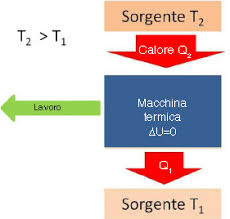

#### Rappresentazione macchina frigorifera

Con La macchina Frigorifera reversibile.

Il segno $W=Q_1-Q_2$ quindi lavoro ottenuto, positivo.

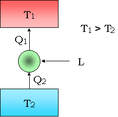

>Coefficente di prestazione di macchina frigorifera(**COP**): $\xi={Q_A\over |W|}$
#### Secondo principio della termodinamica 

> **Formulazione di Clausius**:Non posso avere un processo il cui unico risultato sia trasferire calore da temperatura T ad una temperatura più calda di T. 
>

> **Formulazione di Kelvin-Plank** è impossibile realizzare un processo il cui unico risultato sia trasformare il calore in lavoro.

Le due formulazioni sono equivalenti.
Questo principio è legato allo stesso concetto del tempo.
#### Dimostrazione per assurdo
Ho macchina $\eta$ $X$ generico e $R$ reversibile.

$W=Q_2'-Q_1'$

$W=Q_2-Q_1$

$-W=-Q_2+Q_1$
Ottengo una nuova macchina

$q_1=Q_2'-Q_1'=Q_2-Q_1$

$q_2=Q_2'-Q_2=+(Q_1'-Q_1)$

Il calore che assorbo da una, è il calore che cedo dall'altra
Suppongo che questa macchina

$\eta_x>\eta_R$

${\bcancel{W}\over Q_2'}>{\bcancel{W}\Q_2}$

$Q'2<Q_2$

$q_2=Q_2'-Q_2<0$
Ma allora sto trasferimendo calore da una sorgente più fredda ad una più calda!
Viola il secondo principio nella formulazione di Clausius! **per assurdo** $\eta_x>\eta_R$ è falsa.

Quindi in teoria l'opposto è 
#### Teorema di Carnot
>$\eta_X\le\eta_R$
dove
Il minore vale se la macchina $X$ è **irreversibile,**  ($\eta=1-{Q_1\over Q_2}$) 
L'uguale vale se la macchina $X$ è **reversibile.** ($\eta=1-{T_1\over T_2}$)
(**importante tenere le temperature in KELVIN**)

>**Corollario 1** Tutte le macchine reversibili hanno lo stesso rendimento $1-{T_1\over T_2}$ se lavorano tra  le stesse temperature.

>**Corollario 2** Tutte le macchine irreversibili hanno un rendimento inferiore a  $1-{T_1\over T_2}$ .

>è Importante ricordare che un rendimento può essere solo $0\le\eta<1$.

## 15/04/2019

Ricordando il teorema di carnot dalla volta precedente abbiamo che

$1-{Q_1\over Q_2}\le 1- {T_1\over T_2}$ e ricordiamo che $Q1,Q2 >0$

Effettuando delle operazioni algebriche ottienamo:

$\bcancel{1}-{Q_1\over Q_2}\le \bcancel{1}- {T_1\over T_2}$

${Q_1\over Q_2}\ge {T_1\over T_2}$

$-{Q_1\over T_1}+{Q_2\over T_2}\le 0 \to {(-Q_1)\over T_1}+{Q_2\over T_2}\le 0$

Ora sostituisco $Q$ con $\mathcal{Q}$

$\mathcal{Q}_1=(-Q_1)\\\mathcal{Q}_2=Q_2$

${\mathcal{Q}_1\over T_1}+{\mathcal{Q}_2\over T_2}$

Cioè ho spostato i segni sui calori stessi.

Ottenendo

${\mathcal{Q}_1\over T_1}+{\mathcal{Q}_2\over T_2}+ {\mathcal{Q}_3\over T_3}+{\mathcal{Q}_4\over T_4}$

cioè

>
>**Teorema di clausius**
> $\sum^n_{i=1}{\mathcal{Q}_i\over T_i}\le 0 \to \oint_\Gamma {d\mathcal{Q}\over T}\le 0$
>
> Questo integrale viene chiamato **integrale di clausius**

Dove $\Gamma$ è la seguente area

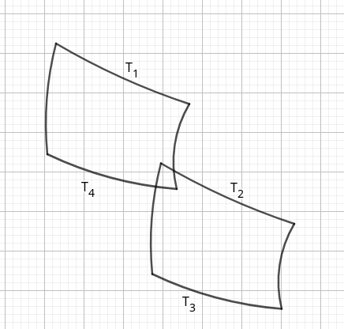
dove i due cicli non devono essere necessariamente uguali. (Li ho resi uguali per semplicità nel copia incolla grafico)
quindi
$\eta_x\le \eta_R\iff\oint {d\mathcal{Q}\over T}\le 0$

Se $\eta_x $ è reversibile

$\eta_x=\eta_R \Rightarrow \oint {d\mathcal{Q}\over T}=0$

Cioè 

> Se il ciclo è **Reversibile**, l'integrale di clausius è **nullo**.

Proseguendo con l'integrale di prima, scompongo:

$I\int^B_A {d\mathcal{Q}\over T}+II\int^A_B {d\mathcal{Q}\over T}=0\xrightarrow{Reversiblile}{}I\int^B_A {d\mathcal{Q}\over T}-II\int^B_A {d\mathcal{Q}\over T}=0$

Ottengo che 

> L'integrale non dipende dal percorso!
>
> Quindi potrei avere un percorso che va da $A$ a $B$ totalmente diverso da quello che da $B$ va ad $A$, il risultato non cambierebbe.

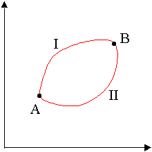
ora ottengo
$I\int^B_A {d\mathcal{Q}\over T}=II\int^B_A {d\mathcal{Q}\over T}=III\int^B_A {d\mathcal{Q}\over T}=S_B-S_A=\Delta S$ dove $S_B$ è l'entropia

#### Entropia
>Entropia è una **funzione di stato** che :
>
>entropia$=S|\Delta S=S_B-S_A=\int^B_{A_{(Reversibile)}} {d\mathcal{Q}\over T}$ 

Facciamo finta di avere un ciclo irreversibile per colpa di $A\to B$

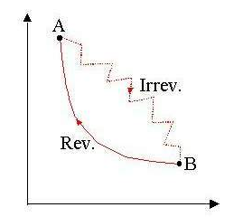

Ottengo che $\oint dQ<0=I\int^B_A {d\mathcal{Q}\over T}+\int^A_B {d\mathcal{Q}\over T}<0$
$I\int^B_A {d\mathcal{Q}\over T}-II\int^B_A {d\mathcal{Q}\over T}<0$ cioè $I\int^B_A {d\mathcal{Q}\over T}<II\int^B_A {d\mathcal{Q}\over T}$

* La parte non reversibile è $I\int$;
* Ciò che varia è che ora ho $<$ al posto di $=$

Dunque

$\Delta S_{AB}>\int^B_A {d\mathcal{Q}\over T}$ reale irreversibile.

Ottengo dunque che

> $\int^B_A {d\mathcal{Q}\over T}\le \Delta S_{AB}$ **dove** $= \text{se reversibile}\\< \text{se irreversibile}$

Ottengo infine che
>* $\Delta S=0$ se **reversibile** $(S_A^{Finale}=S_A^{Iniziale}=0)$
>
>* $\Delta S<0 $ se **irreversibile** 

#### Esercizio di esempio

Avendo due sorgenti di calore
$T_2=380K$

$T_1=280K$

$S=100 cm^2$

$d=2,5cm$

$\Delta S_{universo}=?$(calcolare l'entropia dell'universo)

Uso la **formula di Fourier**: $Q=KS{\Delta S\over d}t$
> **Attenzione**: S sta per superficie, non entropia.

$K_{1l}=201 {J\over mSK}$

${Q|_{1Sec}}=8040J$

$Q|_{1Min}=4,824\cdot 10^5 J$

$\Delta S_u={Q\over T_1}-{Q\over T_2}=453,4 {J\over K}$

---
Tornando alla formula precedente , scritta con i diffferenziali

$dS=^{def} {d_Q\over T}$

$S_B-S_A=\int^B_A({dQ\over T})_{reversibile}>\int^B_A({dQ\over T})_{irreversibile}$

ricordando che $\oint {dQ\over T}<0$ per l'irreversibilità.

---
Quindi, sull'es di prima, l'entropia dell'universo è definita con queste tre equazioni

$\Delta S_{S1}={Q_1\over T_1}$ con $Q_1>0$ perchè la sorgente $S1$ assorbe.

$\Delta S_{S2}=-{Q_2\over T_2}$

$\Delta S=0$

ottenendo 

$\Delta S_{TOT}={Q1\over T_1}-{Q_2\over T_2}$

#### In un sistema isolato
Suppongo di avere un **sistema isolato**, cioè che non ho scambio di calore $dQ=0$

$S_B-S_A=0$

$S_B=S_A$

Quindi

>**Un sistema isolato:**
>1. Se procede per **trasformazioni reversibili** allora **l'entropia non varia**;
>2. Se procede per **trasformazioni irreversibili** allora **l'entropia aumenta**.

*L'entropia, microscopicamente è compatibile con il numero di stati macroscopici(?)*

>$S=c \ln[N]$ dove $N=$*numero di stati possibili*

Quindi l'entropia in questo caso 
>Tende ad evolvere in **stati macroscopici compatibili con stati microscopici**, cioè ho **più disordine**.

Fornendo una definizione più precisa di disordine:
> **Disordine**: Possibilità di scelta.

*Ci basta pensare ad una stanza con dei libri impilati uno sopra all'altro al centro della stanza. Successivamente avremo che i libri (usandoli) verranno spostati nei vari punti della stanza, creando disordine dallo stato iniziale i quali erano posizionati.*

#### Varie considerazioni 

 - l'entropia del sistema **è funzione dello stato termodinamico del sistema**; 
    - non importa nulla se la trasformazione è o non è reversibile. 
    - L'entropia è definita sul processo **reversibile**. 
 - Qual è l'entropia della trasformazione irreversibile fra lo stato A e lo stato B? 
    - Quella di una trasformazione reversibile fra A e B. 
    - Esempio: **l'espansione libera adiabatica (esperienza di Joule):** non c'è scambio di calore con l'eserno, quindi l'integrale di **Clausius** vale **zero**, quindi non c'è variazione di entropia? 
       - **No!** Perché la variazione di entropia si calcola su una trasformazione **reversibile** e evidentemente una espansione libera adiabatica non può esserlo .
 - in conseguenza al punto sopra**, l'entropia del sistema su un ciclo è SEMPRE zero**. A prescindere che il ciclo sia o non sia reversibile.
 - A variare, eventualmente, è l'entropia **dell'universo**
    -  se il ciclo è **reversibile** l'entropia dell'universo **non varia;**
    -  se il ciclo **non è reversibile,** l'entropia dell'universo **aumenta**. 
    - È importante distinguere: variazione di entropia del **sistema** (il gas che stiamo considerando), **dell'ambiente** (tutto il resto, che ad esempio cede o assorbe calore dal sistema), **dell'universo** (**ambiente + sistema**).

### Elettromagnetismo

>**Forza di Coulomb**: $K{q_1 q_2\over d^2}$

$udm[q]=1C$

$[K]=[{F\over qq}d^2]=[{N\cdot m^2\over c^2}]=udm [K]$

Dove $K$ è una costante definita come

$K={1\over 4\pi\epsilon_0}$

avendo

>$\epsilon_0=$ costante dielettrica del vuoto = $8,85\cdot 10^{-12} {c^2\over N\cdot m^2}$

##### Paragone interessante
Forza di Newton$= \vec{F}_{1\to2}=K_G{m_1m_2\over r^2}$
Forza di Coulomb$= \vec{F}_{1\to2}={1\over 4\pi\epsilon_0}{q_1q_2\over r_{12}^2}\cdot \hat{r}_{12}$
Sono molto simili!

* Un oggetto senza massa **non è incline ad accettare interazioni** con la forza di Newton
* Un oggetto che non è carico **non è incline ad accettare interazioni** con la forza di coulomb.

Domande che sorgono:
* Perchè non posso avere masse negative?
* Perchè "d^2"?($\to$ Teorema di Gauss, il quale si applica anche alla massa). Vedremo approfonditamente nella prossima lezione.

## 19/04/2019
*parte esercizio mancante*

$\Delta S_{TOT}=\xcancel{\Delta S_{MAC}}+\Delta S_{env}=$

$\Delta S_{TOT}=\Delta S_{env}\ge 0$

$\Delta S_{TOT}=\Delta S_{env}=0={Q_1\over T_1}-{Q_2\over T_2}$

Sapendo che è Termicamente isolato ($Q_{TOT}=0$)

Tornando all'elettromagnetismo

**Cariche puntiformi**

$\vec{F}_{1\to2}={1\over 4\pi\epsilon_0}{q_1q_2\over |\vec{r}_{12}|^2}\hat{r}_{12}=-\vec{F}_{2\to1}$

$q_1=400_nC$

$q_2=100_nC$

$Q=1_nC$

$r_1=2 mm$

$r_2=1 mm$

$\vec{F}=\vec{?}$

L'inclinazione a muoversi la da la massa, non la carica. Ci manca la massa.

Supponiamo che i due punti siano fissati.
>**Principio di sovrapposizione**: Le forze elettriche sono indipendenti dall'ambiente circostante.

$\vec{F}_{1\to Q}={1\over 4\pi\epsilon_0}{400(nC)^2\over 4(\mu m)^2}\hat{r}_1=$

$={9\cdot10^9\cdot10^{-16}\over10^{-6}}N=9\cdot 10^{-1} N=0,9 N$

$\vec{F}_{2\to Q}={1\over 4\pi\epsilon_0}{100(nC)^2\over 1(\mu m)^2}\hat{r}_2=0,9 N$

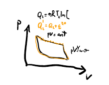

Come è possibile che siano entrambi $0,9N$ nonostante la differenza tra le due cariche? per la distanza.

Ridisegnando l'angolo, faccio la regola del parallelogramma tra $\vec{F}_{1\to Q}$ e $\vec{F}_{2\to Q}$ ottengo $\vec{F}$

$|\vec{F}|=\sqrt{3}\cdot 0,9N=1,55 N$

Calcoliamo il lavoro!

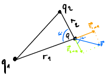

$W=\int^B_A \vec{F}\cdot d\vec{S}={qQ\over 4\pi\epsilon_0}\int^B_A {1\over r^2}\hat{r}\cdot d\vec{S}=\lim_{N\to+\infty}{qQ\over 4\pi\epsilon_0}\sum^N_{i=1}{1\over r^2_i}\hat{r}_i\cdot d\vec{S}_i$
che è uguale a 
$\sum^N_{i=1}{1\over r^2_i}dS_i^{//}$

Ricordiamo che per il lavoro conta solo lo spostamento parallelo al raggio.
Posso immaginarmi di spostare lo spostamento parallelo su un asse.

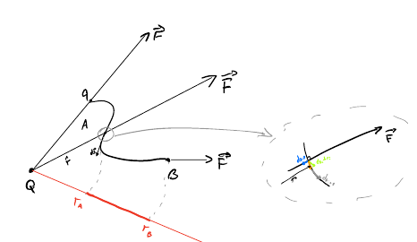

>Quindi alla fine l'integrale conta, indipendentemente dal "percorso" della funzione, tra $r_A$ e $r_B$!
>cioè
>
>${qQ\over 4\pi\epsilon_0}\int^{r_B}_{r_A} {1\over r^2}dr={qQ\over 4\pi\epsilon_0}[{1\over r_A}-{1\over r_B}]$

Conta solo lo **stato iniziale e lo stato finale**.

Otteniamo che la forza elettrica è una forza **conservativa**.

$W_{A\to B}=U_A-U_B=-\Delta U$

$U_p=U(\vec{r}_p)=U(r_p)={qQ\over 4\pi\epsilon_0}{1\over r}+C_G$

con p per punto (puntiforme)

avendo sorgente puntiforme e carica puntiforme.

$C_G$ è una costante. Facendo le differenze poi si semplifica.

##### Autoenergia
Una carica può interagire con se stessa? in quel caso il raggio sarebbe **zero!** il che sarebbe un problema!
Boh.

#### Carica di prova e campo elettrico
$\vec{F}_{TOT}=\sum^N_{i=1} {1\over 4\pi\epsilon_0}{q_1Q\over r^2_i}\hat{r}_i$

$=Q\sum^N_{i=1}{1\over 4\pi\epsilon_0}{q_1\over r_i^2}\hat{r}_i$

$\vec{E}_{TOT}={\vec{F}_{TOT}\over Q}=\sum^N_{i=1}{1\over 4\pi\epsilon_0} {q_1\over r^2_i}\hat{r}_i$

Il campo elettrico ha un corrispettivo fisico.
Un vettore associato a un punto nello spazio.
Posso avere un punto a caso e poter disegnare il campo elettrico!

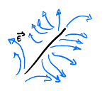

>**Campo elettrico**: Funzione matematica calcolabile in qualsiasi punto dello spazio, associando a questo punto un valore(vettore, tensore, scalare etc...)
>Se il campo è **vettoriale lo descrive un vettore.**

Se **scalare lo descrive un numero.**(ad esempio la temperatura!)

Posso ottenerlo senza **descrivere necessariamente le sue sorgenti.**

con i differenziali
$\vec{F}_{TOT}\xrightarrow{1/Q}{}\vec{E}_{TOT}$
$\vec{U}\xrightarrow{1/Q}{}\vec{V}|\Delta V={\Delta U\over Q}$

## 29/04/2019

$\vec{E}=^{def} {\vec{F}\over q_0}$

Con unità di misura 

$[E]=[{F \over Q}]= udm [E]={N\over C}={V\over m}$

$W_e=\int_c \vec{F}_e\cdot d\vec{l}=^{(*)}\int^B_A \vec{F}\cdot d\vec{l}=^{def} -\Delta U= - [U_B-U_A]=-q_0[V_B-V_A]$

(\*) *L'integrale lungo la curva posso farlo calcolando l'integrale agli estremi ( non è una cosa immediata)*

dove 

$-[U_B-U_A]=W_e=\int _A ^B q_0\vec{E}\cdot d\vec{l}=q_0\int_A^B \vec{E}\cdot d\vec{l}=^{def}=-q\Delta V$ **cioè differenza di potenziale**

#### Carica puntiforme

In una carica puntiforme

$\vec{F}={q_0Q\over 4\pi \epsilon_0 r}\hat{r}$

$\vec{E}={q_0Q\over 4\pi \epsilon_0 r}\hat{r}$

$V={Q\over 4\pi \epsilon_0 r}+costante$

Questa costante vale zero!

####  Energia elettrostatica delle cariche

Avendo quattro punti
$q_1, q_2, q_3, q_4$

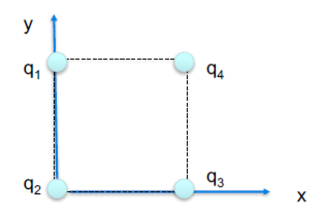

$W=-\Delta U_e|_{q_2}=-q_2\Delta V_e=-q_2[{q_1\over 4\pi \epsilon_0 r_{12}}-\xcancel{q_1\over 4\pi\epsilon_0(+\infty)}]$

Il contributo di $q_3$ verso $q_2$ è 

$W=-\Delta U_e|_{q_3}=-q_3\Delta V_e=-q_3[{q_1\over 4\pi \epsilon_0 r_{13}}-\xcancel{q_1\over 4\pi\epsilon_0(+\infty)}+\dots]$

Quindi otteniamo che è arbitrario come prendo i punti($r_{13},\ r_{12}$)

Lo posso dunque scrivere come **energia elettrostatica delle cariche**

>$U_e={1\over 2}\sum_{i\ne j} {q_iq_j\over 4\pi\epsilon_0 r_{ij}}={1\over 2}\sum_{i\ne j} q_i V_{ji}$

(l'un mezzo è li presente perchè va a formare una matrice **simmetrica**.)

#### Densità lineare

Ho un filo

>$\lambda=$ **densità lineare di carica** $={dq\over ds} \Rightarrow \lambda ds$ *(definizione differenziale, infinitesimale, ha senso in un punto dove il tratto di filo è approssimabile con una retta/segmento)*

con

$q_L=\int ^{P_0+ L}_{P_0} \lambda(s) ds$

Ho una superficie

>$\sigma=$ **densità superficiale di carica** ${dq\over d\Sigma}  \Rightarrow \sigma d\Sigma$ dove $\Sigma$ è la mia superficie con cariche.

con

$q_S=\int ^{P_0}_S \sigma(\Sigma) d\Sigma$

Avendo un volume(tre dimensioni)

>$\rho=$ **densità volumica di carica** ${dq\over d\tau} \Rightarrow \rho d\tau$ dove $\tau$ è il mio volume con cariche.

con 

$q_V=\int ^{S}_V \rho(\tau) d\tau$

<!--*IMMAGINE METRO DA SARTA(boh) SU ESEMPIO LAMBDA*-->

#### Esercizio idrogeno

Calcolo idrogeno

Ricordo che un protone è una sfera$={4\over3}\pi R^3$

$e=1,6\cdot 10^{-19} \mathcal{c}$

$R_n=10^{-15}m$

calcolo $\rho$

$\rho={dq\over d\tau}={Q\over \tau}={1e\over {4\over 3}\pi R^3}={1,6\cdot 10 ^{-20}\mathcal{c}\over 4\cdot 10^{-45} m^3}=4\cdot 10^{25}\mathcal{c}/m^3$

> Ma come fa la densità ad essere negativa? la carica può essere negativa, quindi la densità di carica può essere negativa!

Ora provo a "spalmare" la carica su tutta la superficie 

$R_a=10^{-10}m$ raggio nucleo

$\sigma={d_q\over d\Sigma}={Q\over 4\pi R^2_a}={-16\cdot 10^{-20}\mathcal{c}\over 12\cdot 10^{-20}}$

#### Passaggio al continuo (PAC)
Ho un campo elettrico formato da una serie di cariche

$\vec{E}(\vec{r}_p)=\sum^N_{i=1}{q_i\over 4\pi\epsilon_0|\vec{r}_i-\vec{r}_p|^2}=^{(\sum _i {dq_i}_{ = ds})}\int^B_A ds{\lambda\over 4\pi\epsilon_0|\vec{r}_s-\vec{r}_p|^2}\hat{r}_{SP}$

$\vec{V}(\vec{r}_p)=\sum^N_{i=1}{q_i\over 4\pi\epsilon_0|\vec{r}_i-\vec{r}_p|}=^{(\sum _i {dq_i}_{ = \rho d\tau})}\int^A d\tau{\rho\over 4\pi\epsilon_0|\vec{r}_\tau-\vec{r}_p|}$

$U_e={1\over2}\sum{i\ne j}{q_i q_j\over 4\pi\epsilon_0|\vec{r}_i-\vec{r}_j|}=\dots$

<!--*IMMAGINE PUNTINI FRECCIA PAC CON CUBO*-->

#### somma costante

$W=\Delta E_k=-\Delta U_e=-q\Delta V$

$\Delta E_k+ \Delta U_e=\Delta E_{TOT}=0$

>$\Delta[E_k+qV]=0\Rightarrow E_k+q_V= costante$ !
>

#### Esperimento di Rutherford

Degli studenti sparano delle cariche su una lamina in oro

$E_k=7MeV$ dove $MeV$ è MegaElettronVolt

$q_\alpha=+2e$

$z=76$ cioè il numero atomico dell'oro

$m_a=6,64\cdot 10^{-27} Kg$

Si sono accorti che possono succedere diverse cose

la particella $\alpha$ può passare tra gli atomi dell'oro

più mi avvicino ad un nucleo senza toccarlo più viene deviato

quando lo "colpisco" non lo tocco in realtà, perchè il campo che c'è respinge la nostra particella spedita!

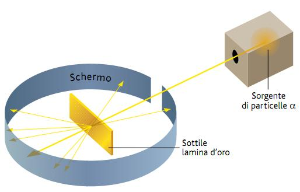

$7\cdot 10^6 eV=1,6\cdot 10^{-19} J$

Inizialmente $E_k^i+\xcancel{qV_i}$

$\xcancel{qV_i}$ perchè sono molto distante(quindi per le grandezze minuscole che prendiamo, con una distanza di un metro è pressochè infinita.)

Finale abbiamo $\xcancel{E_k^f}+qV_f$ 

$\xcancel{E_k^f}$ perchè l'energia cinetica alla fine è zero

Energia cinetica iniziale ${E_k^i}={1\over 2}mV_i^2=2e{z_e\over 4\pi\epsilon_0 x}$

con $x={2ze^2\over 4\pi\epsilon_0 E_k^i}=4,11\cdot 10^{-16} mz$

>**Considerazioni:** 
>
>più alta è l'energia e più posso sondare distanze.
>
più è alto un numero atomico e meno ci avviciniamo!

Se continuo ad aumentare l'energia, il bersaglio si **rompe** prima di toccarlo!

#### Esercizio anello

Ho un anello di carica, spedisco una particella tra l'anello

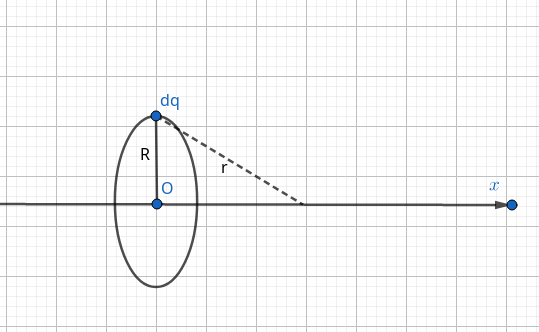

$V(x,0,0)=?$

$\vec{E}(x,0,0)=?$

$dV={dq\over 4\pi\epsilon_0 r}={\lambda ds\over 4\pi \epsilon_0 r}$

$V=\int dV=\int _{anello} {\lambda ds\over 4\pi\epsilon_0r}={\lambda\over 4\pi\epsilon_0 r}\int ds={\lambda 2\pi R\over 4\pi\epsilon_0 r}={Q\over 4\pi\epsilon_0\sqrt{R^2+x^2}}$

con $\lambda 2\pi R=Q$

**Considerazioni finali:**

Se mi allontano tanto vedo una carica puntiforme, quindi la tratto come tale!

se $x=0 \Rightarrow {Q\over 4\pi\epsilon_0 R}$

se ${R\over x}<<1 \Rightarrow {Q\over 4\pi\epsilon_0 |x|}$

## 03/05/2019

$V_A-V_B=\int ^B_A \vec{E}\cdot d\vec{s}$

Abbiamo un **gradiente**

*Che cosa è un gradiente?*

$\vec{E}=-\vec{\nabla}V=-\begin{bmatrix} {\delta V\over \delta x}\\{\delta V\over \delta y}\\{\delta V\over \delta z}\end{bmatrix}$

con  $\vec{\nabla}$ è il gradiente, composto da derivate parziali(?)

Dove ho le derivate parziali:

$E_x= -{\delta\over \delta x}V=2V_0xy(1-z)$

$E_y= -{\delta\over \delta y}V=V_0x^2(1-z)$

$E_z= -{\delta\over \delta z}V=-V_0x^2y$

Da queste tre ho:

$\vec{E}=-\hat{r} {dV\over dr}$

#### Circuitazione 

>**Circuitazione**: $\oint q\vec{E}\cdot d\vec{s}=0$
>
>dove $q\vec{E}=\vec{F}$, ma possiamo togliere la carica $q$ perchè costante, ottenendo:
>
>$\oint \vec{E}\cdot d\vec{s}=0$ che viene più semplicemente scritto come
>
>$\Gamma \vec{E}=0$

>**Tutti i campi conservativi hanno circuitazione zero.**
>

Coinvolgo un integrale chiuso su un dominio chiuso ma è **lineare, unidimensionale!**

#### Flusso

Immagino di avere un campo, vettoriale, che è la velocità delle particelle in un fluido.

Immagino di avere un flusso laminare controllato e che possa analizzare il vettore velocità( il campo è composto da un insieme di vettori velocità!).

Avendo un "setaccio" con il quale passiamo il nostro flusso, se è abbastanza piccolo, posso avere una ottima approssimazione di una superficie piana.

Oltretutto ho un vettore **normale** che non è necessariamente perpendicolare al nostro.

Otteniamo la **definizione di flusso**:

> $d\Phi _{d\Sigma}(\vec{v})=^{def}\vec{v}\cdot \hat{n} d\Sigma$
> 
> Quantità matematica di un campo vettoriale

Allargando la superficie il flusso aumenta.

Il segno del flusso è **arbitrario** in base al vettore **normale**.

disegno coso superfice 

$=\vec{E}\cdot\hat{n}\ d\Sigma={1\over 4\pi\epsilon_0}{q\over r^2}{\hat{r}\cdot\hat{n}}\ d\Sigma={q\over 4\pi\epsilon_0}\cos\theta {d\Sigma\over r^2}$

con $\cos\theta {d\Sigma}$ scrivibile come $d\Sigma_r$

diventando

${q\over 4\pi\epsilon_0}{d\Sigma_r\over r^2}$

Prendiamo la superficie ortogonale al vettore che stiamo valutando($\cos\theta=0$)

#### Angolo solido

Angolo portato alle tre dimensioni

Avendo un arco di circonferenza, portato ad un cilindro abbiamo

${\overparen{a}\over R}=\alpha$

cioè

${\overparen{e}\over R}={2\pi\cancel{R}\over\cancel{R} } $

ottenendo

$\Omega_{TOT}={S\over R^2}={4\pi R^2\over R^2}=4\pi$

#### Teorema delle superfici di Gauss

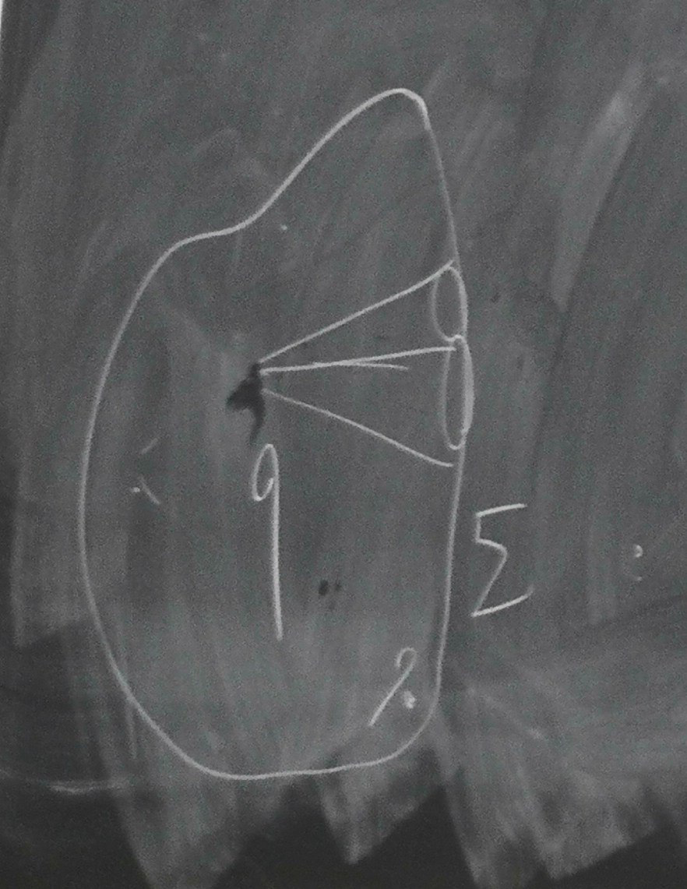

>$\Phi_{\Sigma}(\vec{E})=\int d\Phi={q\over 4\pi \epsilon_0}=\int d\omega={q\over \cancel{4\pi} \epsilon_0}\cdot \cancel{4\pi}={q\over \epsilon_0}$
>
>cioè 
>
>$\Phi(\vec{E})={\sum_i q_i\over \epsilon_0}$

Si basa sulla definizione di interno ed esterno.

>Vale ciò solamente sulle **superfici chiuse** .

Osservazioni:
1. Il teorema non parla della superficie, posso prendere qualsiasi tipo!
2. **Non devo specificare il raggio della sfera!** (il Flusso rimane lo stesso)
3. Il teorema non dipende dalla posizione della carica.
4. I campi sono sommabili, se avessi più cariche prendo la somma delle singole cariche!

>**Il flusso del campo elettrico dipende solo dall'angolo solido!**

##### Esempio

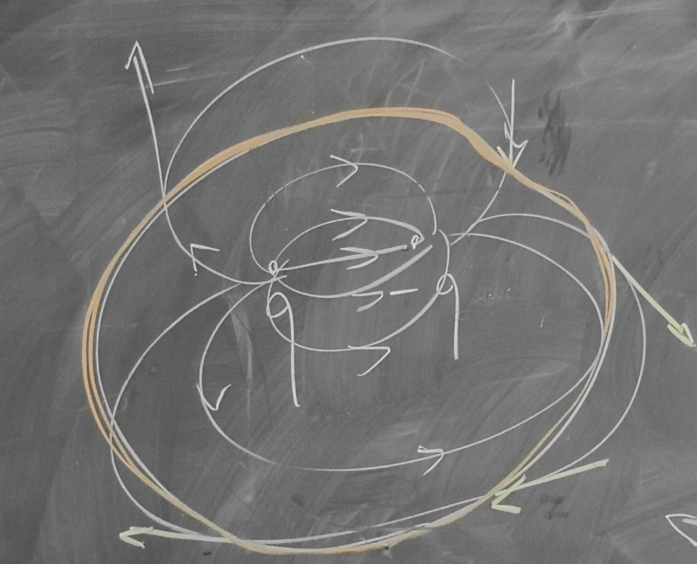

>I singoli contributi non saranno zero, il campo non è zero sulla superficie! 

##### Osservazioni

il **flusso** del campo $E$ attraverso una superficie **chiusa** vale $q\over \epsilon_0$,  **se la carica è all'interno della superficie chiusa**  .

Se è **all'esterno**, il flusso attraverso la superficie chiusa vale **zero**.

##### Esercizio

Quanto vale il campo elettrico in funzione della posizione?

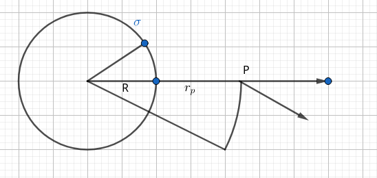

$\vec{E}(\vec{r})=\vec{?}$

Noto che il problema è puramente radiale.

Prendo un punto P a caso, sarà a distanza $r_P$

otteniamo con il teorema di gauss

La fisica mi dice che

$\Phi_{S_D}(\vec{e})=^{phys} {q\over \epsilon_0}$

La matematica mi dice che

$\Phi(\vec{e})=E4\pi r_p^2$

ed ottengo

$E={q\over 4\pi\epsilon_0}{1\over r^2_p}$

>Ma è uguale alla carica puntiforme! Però questo non vale in un caso generico. Infatti se assumo di avere una circonferenza dentro , abbiamo tutte le cariche all'esterno. Quindi la nostra A avrà $E=0$. In specifico:

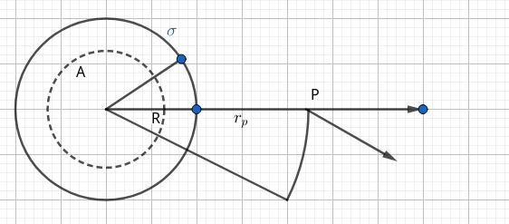

La fisica mi dice che

$\Phi_{S_A}(\vec{e})=^{phys} 0$

La matematica mi dice che

$\Phi(\vec{e})=E4\pi r_A^2$

ed ottengo

$E=0$

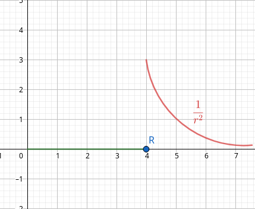

## 06/05/2019

#### Esempio uno

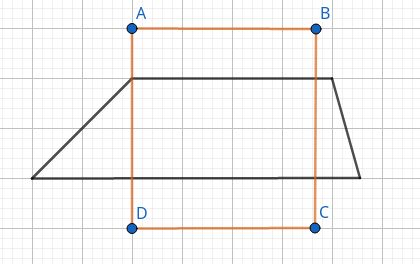

 

$\Gamma (\vec{E})=0$

$\Phi(\vec{E})={q_{int}\over \epsilon_0}$

Come varia il campo elettrico al variare della superficie?

ho $\sigma(x,y,z)$ e $\vec{r}=(x,y,z)$

Ho che 
$\bar{AB}=\bar{CD}$

$\bar{BC}=\bar{DA}<<\bar{AB}$

$\bar{BC}=o(\bar{AB})$

come sappiamo il campo elettrico che è in un punto è la somma dei campi che esercitano in quel punto.

ottengo la circuitazione

$\Gamma_{\square} (\vec{E})=\oint_\square \vec{E}\cdot d\vec{l}= \vec{E}_2\cdot \vec{AB}+\xcancel{(\vec{E}_2 ? \vec{E}_1)\cdot \vec{BC}}+\\\vec{E}_1\cdot \vec{CD}+\xcancel{(\vec{E}_1?\vec{E}_2)\cdot \vec{DA}}$

Li cancello perchè sono infinitesimali!

ottengo

> $\Gamma (\vec{E})=0\oint \vec{E}\cdot d\vec{l}=E_{2t}-E_{1t}=0 \Rightarrow E_{2t}=E_{1t}$

cioè il campo elettrico non varia, è conservativo

#### Esempio due

Abbiamo un cilindro 

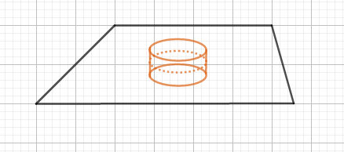

$\Phi_{cyl}\vec{E}=^{math} \vec{E}_2\cdot \hat{n}_2 S+\xcancel{(\vec{E}_1?\vec{E}_2)\cdot \hat{n}_2 S_2}+\\+\vec{E}_1\hat{n}_1S=(E_{2n}-E_{1n})S$

Posso rimuovere anche qui perchè è infinitesimale.

Ottengo dunque che 

>$\Phi_{}\vec{E}={q_{int}\over \epsilon_0}\Rightarrow E_{2n}-E_{1n}={\sigma\over\epsilon_0}$
>

Campo elettrico varia di $\sigma\over\epsilon_0$

> Unendo questi due otteniamo
>
> $\begin{cases}\Gamma (\vec{E})=0\oint \vec{E}\cdot d\vec{l}=E_{2t}-E_{1t}=0 \Rightarrow E_{2t}=E_{1t}\\ \Phi_{}\vec{E}={q_{int}\over \epsilon_0} \Rightarrow E_{2n}-E_{1n}={\sigma\over\epsilon_0}\end{cases}\Rightarrow  \ \ \ \ \ \vec{E}_2-\vec{E}_1={\sigma\over \epsilon_0}$ 
>
> con $n>\epsilon_0$

*correzione esercizio per casa che mi sono perso*

#### Campo elettrico di un piano indefinito di carica

Come fa il campo elettrico nello spazio?

$\vec{E}(\vec{r})=?$

---

**Q: Posso assumere di avere distanza infinita ?**

A: $L_P\over d$ quindi ogni punto sarebbe uguale all'altro se avessi distanza infinita.

---

Avendo una piana di carica positiva, il campo elettrico infinito sarà così

> $\vec{E}_2-\vec{E}_1={\sigma\over\epsilon_0}\hat{n}_2\\ \vec{E}_2-(-\vec{E}_2)={\sigma\over\epsilon_0}\hat{n}_2\Rightarrow\vec{E}={\sigma\over2\epsilon_0}\hat{n}$

Dato che il piano è infinito, non si ha una dipendenza dalla distanza, infatti ${\infty\over d=1m}=\infty$

come ${\infty\over d=1GPa}=\infty$

#### Conduttori

>**Conduttore**: Materiale sul quale un certo tipo di  elettrone può muoversi liberamente.
>

1. Se un conduttore è neutro la somma delle cariche fa zero.
2. Se ho un conduttore all'equilibrio allora ho le cariche ferme
3. Se le cariche sono ferme, nessuna di loro subisce forze, di nessun tipo, nemmeno elettriche.

**Non possono esserci cariche all'interno del conduttore:** se ci fossero ci sarebbe un campo all'interno del conduttore, quindi le cariche si respingerebbero, portandosi sulla superficie.

$\vec{E}_{int}=\vec{0}$

##### Induzione

Se ho una barra conduttore, dentro è zero e tutte le cariche sono negative all'esterno. Se una carica si depositasse all'interno, dovrebbe agire in base al campo elettrico sul bordo.

Se ho una penna bic, la carico sfregandola su una maglietta, non essendo conduttore (plastica) si piazzano tutte all'esterno!

>Appena lo avvicino alla mia barra conduttore  **induco un moto di cariche**.
>
L'**induzione** è dunque l'indurre un moto di cariche tra qualcosa a qualcos'altro.

*Le cariche negative vanno al contrario della freccia che creiamo*

##### Induzione Completa

Supponiamo di avere due conduttori

una sfera ed una sfera che la "abbraccia".

La sfera interna è carica positivamente, la sfera esterna si caricherà negativamente.

( Vedi immagine: condensatore sferico)

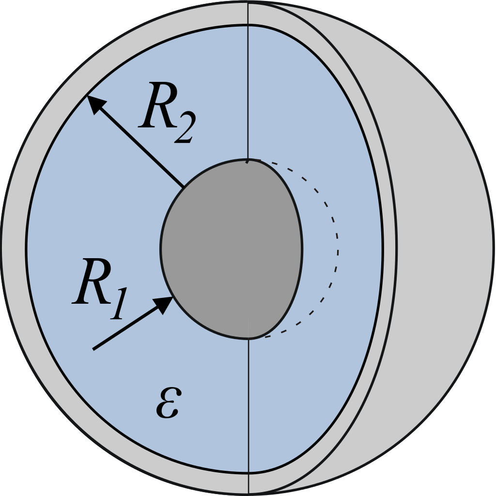

>Ho dunque un caso di induzione **completa** tra i conduttori, perchè TUTTE le linee di un conduttore vengono intercettate dall'altro. Tutte le linee di campo che escono da uno dei due conduttori viene intercettato dall'altro.

Se avvicinassi la sfera carica positivamente ad un conduttore, **avrò un ammasso di cariche negative dalla parte più vicina alla sfera,** perchè le linee di campo della sfera caricata positivamente.

Se avessi due linee di campo , una positiva ed una negativa, quella negativa intercetterebbe quasi tutte le linee di campo delle positive.

*Questo perchè si annullano a vicenda*.(vedi immagine: condensatore piano)

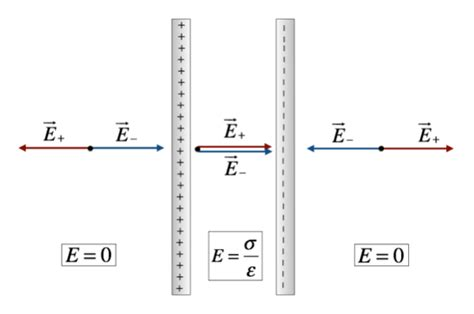

*Non ci soffermiamo sugli effetti di bordo.*

>La superficie di un conduttore è **equipotenziale** cioè sempre costante.
>
$E=0=-{dV\over dr}\Rightarrow V=costante$

Più carica verso e più il potenziale della sfera **aumenta**.
Per il principio di **sovrapposizione** posso calcolare ogni punto di carica della sfera.

##### Capacità
> $C={Q\over V}$
> 

$udm[C]={1C\over 1V}=1F$ un farad.

Un farad è grandissimo. Infatti si utilizza spesso pico/nano/femto/micro-Farad.

>Se abbiamo un sistema in induzione completa, la capacità è data da due conduttori
>
>$C={Q\over V_2-V_1}$
>

##### Esempio

Due armature quadrate 

$S=1m^2$

$d=1mm$

$E={10KV\over m}$

$C=8,85\cdot 10^{-9} F$

Calcolare la carica delle armature.

(Si trovano in vuoto/aria).

Calcolo Q

$Q=C\Delta V$

$C$ ce lo fornisce il problema, calcolo $\Delta V=E\cdot d$

$Q=CEd=8,85\cdot 10^{-9}F\cdot 10^4\cdot 10^{-3}\mathcal{c}$

Ottenendo $Q=C\Delta V=8,9\cdot 10^{-8}\mathcal{c}$

**Osservazioni:**

1. Un condensatore mi serve per portarmi in giro energia.
2. Per caricarlo devo fare del lavoro, per colpa della differenza di potenziale.

## 10/05/2019
#### Corollari

$\vec{E}=\vec{O}$ all'interno

Posso immaginare che tutte le cariche siano appoggiate all'esterno.

Non è vero che dentro il campo è nullo, però stiamo guardando macroscopicamente.

*la materia è vuota, abbiamo molta distanza(relativamente alla grandezza usata) tra nucleo ed elettroni*

**Corollario**(del fatto che il campo è zero all'interno, macroscopicamente parlando)

1. >Il campo è zero perchè alla fine consideriamo statico.
   
   $\Phi_{\Sigma}(\vec{E})=^{MATH} \oint_{\Sigma} \vec{E}\cdot \hat{n}d\Sigma=0$ perchè $\vec{E}=0$ mentre $=^{PHYS}{q_{int}\over \epsilon_0}$

2. >Le superfici dei conduttori sono equipotenziali: 

    $P_1,P_2\in \text{conduttore}$

    $V(P_1)-V(P_2)=-\oint_{P_1}^{P_2}\vec{E}_{int}\cdot d \vec{l}=0$ sempre perchè $\vec{E}_{int}=0$

    $\Rightarrow V(P_1)=V(P_2)$
    
3. >Ho più carica concentrata sui punti di curvatura minore che su un'area più vasta.(effetto punta)
   
   $\vec{E}_{ext}\ne\vec{O}$
   
   $\vec{E}_{int}=\vec{O}$
   
   $\vec{E}_{ext}-\xcancel{\vec{E}_{int}}={\sigma\over \epsilon_0}\hat{u}_n$
   
   Tutta la carica va a distribuirsi nei carichi di curvatura minore perchè devono avere la stessa differenza di potenziale.
   
>Vale solo se i punti sono interni

#### Osservazioni sulla capacità

$C={q\over V}$

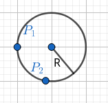

Calcoliamo la capacità della sfera

$V(P)-V(+\infty_{=0})=-\int^{r_p=R}_{+\infty}\vec{E}\cdot d\vec{r}=+{q\over 4\pi\epsilon_0}\int_R^{+\infty} {1\over r^2}dr={q\over 4\pi\epsilon_0}\cdot{1\over R}$

Ottengo

$V={q\over 4\pi\epsilon_0}{1\over R} \Rightarrow C={q\over V}=4\pi\epsilon_0 R$

1. La capacità non dipende dalla carica che mettiamo
2. Dipende dal corpo, dalla sua geometria(quanto è grande)
3. DIpende dal materiale(dato da $\epsilon$)

#### Conduttore cavo

immagino che il mio conduttore sia cavo

Ho un campo elettrico, dalle cariche $+$ alle cariche $-$, con la circuitazione del campo elettrico ($=0$ perchè il campo è conservativo)

Avendo due tratti, $I$ non nel campo, mentre $II$ nel campo.

$\xcancel{\int_I \vec{E}\cdot d\vec{l}}+\int_{II} \vec{E}\cdot d\vec{l}\ne 0$

>Se sulla superficie interna  di un conduttore ci fosse carica violerebbe la circuitazione! quindi anche se faccio una cavità non posso avere cariche nella cavità interna!
>

#### Schermatura e induzione completa(cavo dentro cavo)

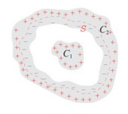

$\Phi_{\Sigma}(\vec{E})=^{MATH} \oint_{\Sigma} \vec{E}\cdot \hat{n}d\Sigma=0$ perchè $\vec{E}=0$ mentre $=^{PHYS}{q_{int}(\Sigma)\over \epsilon_0}$

Ma ho un problema, perchè ho un campo dentro. 

La carica si dispone in base alla curvatura.

>Ma posso affermare che la carica negativa è nella parte interna del $C_2$! 
>
Ottengo una **induzione completa!**

Quindi ho un campo anche interno del conduttore cavo, se ho un altro conduttore dentro.

>Qualsiasi cosa io faccia sul conduttore dentro, non è percepibile da fuori.
>

**Q:Cosa succede se tolgo/metto carica all'esterno?**

A: Niente. 

> Creo uno **schermo elettromagnetico** o **gabbia di faraday** 
>
>Non è possibile far penetrare informazioni dall'interno all'esterno.

**Q:Cosa succede se sposto il tutto in una zona con una fortissima carica?**

A: Viene variato solo il campo del conduttore esterno.. 

*Non è possibile far penetrare informazioni dall'interno all'esterno.*

**Q:Cosa succede se li faccio toccare?**

A: All'interno cambia il campo, all'esterno non succede niente. 

#### Protezione dagli sbalzi 

Immagino di avere un pezzo molto importante di un circuito. Se ho uno sbalzo di tensione, dovrei essere capace di proteggermi per evitare che si fulmini.

Ad esempio ho due chip collegati con differenza di potenziale rispettivamente $8v$ e $5v$

il primo va da $0-8$ il secondo va da $0-5$

Ma non è detto che lo veda alla stessa potenza, perchè lo zero del primo potrebbe essere un $40v$ del secondo!

> Collegando a massa("a terra"), cioè ad un conduttore comune, ho lo stesso **zero** per tutti.
> 

**Q: E se il conduttore che ci attacco è più grande?**

A: la carica si sposta su quello più grande!

**Q: E se il conduttore che ci attacco è la terra?**

A: In quel caso la carica esterna sul mio primo conduttore è quasi nulla!

>Questa è la famosa **messa a terra**, fa in modo che il riferimento di potenziale sia **stabile** e non cambia.
>

**Q: Ma se la carica esterna va tutta sulla terra, la carica interna cosa fa?**

A: niente. La carica interna è schermata da quella esterna.

#### Condensatore piano

$C={q\over V_2 -V_1}={q\over \Delta V}$

$C_{piano}={q\over \Delta V}=\epsilon_0{\Sigma\over h}$

$E={\sigma\over \epsilon_0}$

$\Delta V=Eh={\sigma h\over \epsilon_0={\cancel{q_\Sigma} h\over\epsilon_0}}$

Cresce al diminuire della distanza
Dipende dal materiale

#### Condensatore sferico

$\Delta V= {q\over 4\pi\epsilon_0}[{1\over R_1}-{1\over R_2}]$ cioè $[V_1-V_2]$

$C={4\pi\epsilon_0\over {1\over R_1}-{1\over R_2}}$

$\lim_{R_2-R_1\to 0} C_{sphere}=C_{piano}|_{\Sigma=4\pi R^2 r\ \  h=\epsilon} $

#### Condensatore cilindrico

$\vec{E}={\lambda\over {2\pi\epsilon_0 r}}\hat{u}_r$

$\Delta V={\lambda\over 2\pi\epsilon_0}\ln({R_2\over R_1})$

cioè 

$C={2\pi\epsilon_0 d\over \ln{R_2\over R_1}}$

## 13/05/2019

#### Energia immagazzinata in un condensatore

Per muovere una carica all'interno di un campo elettrico

$dW=q\vec{E}\cdot d\vec{l}$

Ho un consensatore inizialmente scarico, un interruttore che sta tra il condensatore e la batteria.

La capacità del condensatore ricordiamo che è

$C={Q\over \Delta V}$

$Q=C\cdot \Delta V$

Appena clicchiamo sull'interruttore, la prima carica si muove.

Quando parte il secondo elettrone, va ad agire in un sistema **non più privo di cariche**.

Essendocene già una, incontra un campo. Per spostare la seconda, devo effettuare del **lavoro**.

Per la terza ancora più lavoro della seconda.

Dobbiamo agire contro il campo elettrico formatosi.

Provo a calcolarmelo

$\Delta V=E\cdot h$

$dW=\xcancel{q\cdot E dl}=dq E\cdot h=dq \Delta V= dq{q\over C}$

$W|^Q_0=\int^Q_0 qdq={1\over2}{Q^2\over C}=_{(1)}{1\over2}C(\Delta V)^2={1\over2}Q\Delta V$

Questa è la carica nel mio condensatore.

Ora taglio il cavo agli estremi del condensatore.

> Il condensatore **conterrà energia** sotto forma di lavoro utilizzato per caricarlo.
>
>$U=W={1\over2}{Q^2\over C}$

Se ci aggiungo **un led, il led si accende**.

$U={1\over2}C(\Delta V)^2={1\over2}C \cdot E^2\cdot h^2={1\over2}\epsilon_0{\Sigma\over \cancel{h}}E^2h^{\cancel{2}}$

Sappiamo che $\Sigma\cdot h=V$ volume

otteniamo, come risultato generale

$U={1\over2}\epsilon_0 E^2 V\Rightarrow u={1\over 2}\epsilon_0 E^2$

Sottolineo:

>$u={1\over 2}\epsilon_0 E^2$

In quel punto ho una densità di energia proporzionale al quadrato di $E$

Abbiamo energia ovunque!

>Questa energia è immagazzinata dallo spazio tempo. È ovunque. La luce e tutti i vari tipi, è energia, quindi anche le onde elettromagnetiche. Portano energia.
>
Solo per il fatto che ci sia luce, ho un campo elettrico, quindi ho energia.

#### Esercizio

Le cariche sono sulla superficie 

$R=10^{-15}m$

$q=1e=1,6\cdot10^{-19}C$

$E={1\over 4\pi\epsilon_0}{q\over r^2}$

$r\ge R$

questa è la quantità di energia che un protone immette nell'universo.

$u={1\over 2} \epsilon_0 E^2={1\over 2} \epsilon_0({1\over 4\pi\epsilon_0} {q\over r^2})^2={1\over 32\pi^2 \epsilon_0}$ $e^2\over r^4$

$U=\int^{+\infty}_R d\tau u=\int^{+\infty}_R 4\pi r^2 dr {1\over 32\pi^2 \epsilon_0} {e^2\over r^4}={e^2\over 8\pi\epsilon_0}\int^{+\infty}_R dr{1\over r^2}={e^2\over 8\pi\epsilon_0}\big[{1\over2}\big]^{+\infty}_R={e^2\over 8\pi\epsilon_0 R}$

>**Osservazioni:**
>
>L'elettromagnetismo non funziona per le cariche puntiformi, avrei energia infinita su un punto!
>
La carica positiva e la carica negativa **forniscono lo stesso contributo**, avendo il quadrato.

#### Esercizio generico
##### 1
Condensatore piano

$F=-{dU\over dx}$

condensatore collegato ad un generatore $U=_{\Delta V=costante} {1\over2}C(\Delta V)^2={1\over 2}\epsilon_0 {\Sigma\over x}(\Delta V)^2\Rightarrow F=-{dU\over dx}={1\over2}\epsilon_0{\Sigma\over x^2}(\Delta V)^2$

Condensatore Isolato $U=_{q=costante} {1\over2} {Q^2\over 2={1\over 2}{Q^2\over \epsilon_0 \Sigma}}x\Rightarrow F={-dU\over dx}=-{1\over 2}{Q^2\over \epsilon_0\Sigma}$

##### 2
Un condensatore piano è composto da due armature

All'interno del condensatore ho un materiale dielettrico con costante 2 che lo riempie completamente

$C=1pF$

$\Sigma= 1mm^2$

$h=?$

$\epsilon_r=2$

Calcola $h$.

$C=\epsilon_0 {\Sigma\over h}$ è generale, nel nostro esempio con il materiale scelto:

$C=\epsilon {\Sigma\over h}$ con $\epsilon=\epsilon_r\epsilon_0$(definizione)

$C=\epsilon {\Sigma\over h}\Rightarrow h={\epsilon \Sigma\over C}={2\cdot 8,85\cancel{\cdot 10^{-12}}\cdot 10^{-6}\over 10^{-12}}m=17,7\mu m$

##### 3

Sull'oggetto precedente, viene immagazzinata una carica $Q=10\mu C$

Calcolare $u=?$ e $U=?$

$u={1\over2}\epsilon E^2$

mi calcolo $E={\Delta V\over h}=$ so che $\Delta V$ lo ottengo da $C={Q\over \Delta V}$

quindi

$E={\Delta V\over h}={Q\over C h}={Q\over \epsilon{\Sigma\over \cancel{h}}\cancel{h}}={Q\over \epsilon\Sigma}$

Non dipende da $h$ .

Tornando a $u$

$u={1\over2}\epsilon E^2={1\over 2}\epsilon({Q\over \epsilon \Sigma})^2= {1\over 2}{Q^2\over \epsilon \Sigma^2}={10^{-10}\cdot C^2\over 2\cdot 2\cdot 8,85\cdot 10^{-12}\cdot 10^{-12} C^2} {J\over m^3}= 3{10^{-12}\over 10^{-12}\cdot 10^{-12}}{J\over m^3}\simeq 3\cdot 10^{12} {J\over m^3}$

Ho una distanza molto piccola, per quello ho così tanta energia!

**ATTENZIONE A NON USARE LA FORMULA DEL PUNTIFORME**, non vale qui.

quindi abbiamo

$u=3\cdot 10^{12}{J\over m^3}$

$U=\dots=53J$(*non ho fatto in tempo a copiarla , ma basta applicare la definizione di $U$*)

##### 4

Sull'es precedente, calcolare il campo

$E={\Delta V\over h}={{Q\over C}\over h}= {10\cancel{\mu} C\over 1pF 17,7 \cancel{\mu}m}=6\cdot 10^{11} {V\over m}$

## 17/05/2019

### Corrente Elettrica

Avendo il rame, il cui simbolo è $Cu$, ha un portatore libero.

Ci calcoliamo la densità di elettroni di conduzione

$n={N_A\rho\over A}$ dove $\rho$ è la densità di massa.

ricordiamo che il numero di avogadro è $N=6,022\cdot 10^{23}$

Proseguiamo con i conti:

$n={N_A\rho\over A}={6,022\cdot 10^{23}\cdot 8,96\cdot 10^6\over 63,55}{e\over m^3}=8,5\cdot 10^28 {e\over m^3}$

abbiamo dunque in un micron di rame un numero di elettroni pari a $\tau=1\mu m^3\Rightarrow 10^{11} e^-$

abbiamo una **temperatura**. Usiamo **boltzman**

${1\over2}m\bar{v}^2={3\over 2}K_B T$

Ora proseguiamo

$\sqrt{\bar{v}^2}=\sqrt{{3K_B T\over m}}=1,16\cdot 10^5 m/s$

$T=293K$ e $m=0,9\cdot 10^{-30} Kg$

questo non è totalmente corretto, perchè bisognerebbe sconfinare nel quantistico, ottenendo 

$v_F=\sqrt{{3E_F\over m}}=1,6\cdot 10^6 m/s$ dove $E_F$ è energia di Fermi.

*Notiamo che è sbagliato di un fattore 10, non troppo per i nostri specifici.*

ricordiamo che **velocità della luce** $c\simeq3\cdot 10^8 m/s$

Abbiamo un **moto browniano** perchè continuano ad essere urtati, viaggiando ad un centesimo della velocità della luce.

Se ho un campo elettrico $\vec{E}\ne\vec{0}$ cosa succede?

Il loro movimento non è più determinato solo dall'urto, ma anche da un campo che ne devia la traiettoria.

A che **velocità**? calcoliamocela.

>**Intensità di corrente** $i=^{def} \lim_{\Delta t\to 0} {\Delta q\over \Delta t}={dq\over dt}$
>
> avendo $u.d.m.[i]={1C\over 1s}=1A$ Ampere.

> **Corrente elettrica**: Quantità di carica elettrica che attraversa una determinata superficie nell'unità di tempo.
> 

Posso definire la corrente anche così:

> $\vec{j}=ne\vec{v}_d$ dove $\vec{v}_d$ è la velocità di drift.

Cioè il **flusso di corrente che passa in quella superficie.**

>$i=\int _{\Sigma} \vec{j}\cdot \hat{u}_n d\Sigma$ 

Qui possiamo definire anche $j\Sigma=\int _{\Sigma} \vec{j}\cdot \hat{u}_n d\Sigma$ se ho esempi *non patologici(?)*

#### Esercizio

$\Sigma=4mm^2$

$i=8A$

$V_D=?$

Possiamo dire che $i=j\Sigma=nev_D\Sigma$

ottenendo la velocità di drift

$v_D={i\over ne\Sigma}=\dots=1,47\cdot 10^{-4}m/s$

confrontandola con la velocità di Fermi

$V_F=1,6\cdot 10^6 m/s$

*(il conto è stato fatto con il rame)*

confrontandolo con un autoscontro è come se ci fosse una macchina che si muove *un nanometro al secondo*. La cosa positiva è che ci sono **tante** macchine. 

#### Legge della conservazione della carica

>La corrente $i=\oint \vec{j}\cdot\hat{u}_n d\Sigma=-{{\rho}q_{int}\over \rho t} $

Questo ci dice che **tanto entra tanto esce**.

*Come in un tubo, se entra 1 litro di acqua e non ho **ne perdite ne affluenti** (cioè variazioni), avrò in uscita lo stesso litro di acqua.*

#### Regime stazionario

>$i_{chiusa}=0$

cioè

$-j_1\Sigma_1+j_2\Sigma_2=0$ allora vuol dire che $j_1\Sigma_1=j_2\Sigma_2$

#### Legge di ohm

Avendo un protone e neutrone

$\vec{j}=n_+e\vec{v}_+-n_e\vec{v}_-$

otteniamo che

>Legge di Ohm(definizione potenziale): $\vec{j}={1\over \rho} \vec{E}$
>

che mi porta a 

$i={1\over \rho}\cdot \vec{E}\cdot \hat{n}\Sigma$

dove integrando otteniamo

$\int^B_A \vec{E}\cdot d\vec{l}=\int^B_A\vec{E}\cdot \hat{n}\ d\vec{l}= Eh$

$=^{def} V_A-V_B=\Delta V$

unendo queste due precedenti otteniamo

$E={\Delta V\over h}$

> **Resistenza elettrica:** ${1\over \rho}{\Delta V\over h}\Sigma\Rightarrow \Delta V=\rho{h\over \Sigma} i$ dove $R=\rho{h\over \Sigma}$
> 
> $udm[R]=1\Omega$

infine

> Legge di ohm(elettronica): $\Delta V= R\cdot i$
> 

$R$ può anche essere scritto come $\int {q\ dl\over \Sigma}$

#### Altro esercizio

$R={1\over \sqrt{\pi}}$

$l=1m$

$\rho_{Au}=2,35\cdot 10^{-8}\Omega m$

La resistenza sarà

$R=2,35\cdot 10^{-2}\Omega$

#### Potenza

>Potenza del singolo elettrone
>
$P=\vec{F}\cdot\vec{v}=e\vec{E}\cdot\vec{v}_D$

Se voglio calcolarla per il volume/densità di elettroni

$P_{\tau}=nP=ne\vec{E}\cdot\vec{V}_D=ne\vec{v}_D\cdot \vec{E}=\vec{j} \vec{E}=_{(\vec{j}{{1\over\rho}\vec{E}})} {1\over \rho}{E}^2$

ma equivale anche $\rho j^2$

Ora

$dP=P_{\tau}\Sigma dh=\rho j^2\Sigma dh=_{(j={i\over \Sigma})} \rho({i\over \Sigma})^2\Sigma dh=\rho {dh\over \Sigma}\cdot i^2\to P=\int^l_{lunghezza 0} dP=\rho {l\over\Sigma}i^2$

ottenendo 

>$P=R\cdot i^2$
>
>o equivalentemente con la legge di Ohm
>
$P={\Delta V^2\over R}$

Questa potenza viene dissipata in **calore!**(**Effetto Joule**)

## 20/05/2019

#### Resistenze in serie e in parallelo
Cosa succede se attacco una resistenza $R_1$ in serie a resistenza $R_2$?

 

e se fossero in parallelo?

##### Resistenza in serie

$\Delta V_1$ sarà il delta calcolato su $V$ prima e dopo $R_1$

$\Delta V_2$ sarà il delta calcolato su $V$ prima e dopo $R_2$

$i_1=i_2$

${\Delta V_1\over R_1}={\Delta V_2\over R_2}$

Per la regola della conservazione della carica:

$Req|\Delta V=Req \cancel{i}$

dove $\Delta V=\Delta V_1+\Delta V_2$ ottenendo $=R_1\cancel{i_1}+R_2\cancel{i_2}$

Quindi

> $R_eq=R_1 (serie) R_2=R_1+R_2$
> 

##### Resistenza in parallelo

Uso la conservazione dei $\Delta V$

$\Delta V= V_B-V_A=\\\Delta V_1=R_1 i_1\\\Delta V_2=R_2 i_2\\\Delta V_{eq}=R_{eq} (i_1+i_2)$

questo perchè $\Delta V_1=\Delta V_2= \Delta V_{eq}$

Quindi

>${1\over R_{eq}}={1\over R_1(parall)R_2}={1\over R_1}+{1\over R_2}$

#### Campo non conservativo e forza elettromotrice
Ho un campo elettrico 

$V_A-V_B=\int^B_A\vec{E}\cdot d\vec{s}=R i$

dove $\vec{E}$ è il generatore.

Avendo un circuito chiuso

> $\oint \vec{E}\cdot d\vec{s}=R_Ti$

con $R=\rho {h\over \Sigma}$ 

Per le forze conservative, la circuitazione valeva zero. Ma abbiamo detto che (per la circuitazione) $\oint \vec{E}\cdot d\vec{s}=0$

Beh possiamo dire che questo campo **non è un campo conservativo**.

In dettaglio, provando sul **campo elettrostatico**

$\oint \vec{E}_{el}\cdot d\vec{s}=\int_A^B \vec{E}_{el}\cdot d\vec{s}+\int^A_B\vec{E}_el\cdot d\vec{s}=0$

dove $\int_A^B \vec{E}_{el}\cdot d\vec{s}=$ *ext generatore*

$\int^A_B\vec{E}_el\cdot d\vec{s}=$ *int generatore*

Possiamo dunque definire $\vec{E}^*$ <u>non conservativo</u>

- **all'interno del generatore** ho $\vec{E}_{el}+\vec{E}^*$
- **all'esterno** $\vec{E}_{el}$

cioè 

$\int ^A_B \vec{E}\cdot d\vec{s}=\int^A_B(\vec{E}_{el}+\vec{E}^*)\cdot d\vec{s}$

Definiamo dunque **f.e.m.**: Forza elettromotrice ($udm$ volt)

>$f.e.m.=^{def}\int^A_B\vec{E}^*\cdot d\vec{s}$
>
> con $|\vec{E}^*|>|\vec{E}|$

#### Resistenza interna

>$\int_A^B(\vec{E}_{el}+\vec{E}^*)\cdot d\vec{s}=r i$ cioè **resistenza interna**.

Se ho una resistenza interna, dissipa calore! Un buon generatore ha resistenza interna **bassa**.

#### Considerazioni

Sapendo

$\oint (\vec{E}_{el}+\vec{E}^*)\cdot d\vec{s}=R_T i$

abbiamo che

$\int^B_A(\vec{E}_{el}+\xcancel{\vec{E}^*})\cdot d\vec{s}+{\int^A_B (\vec{E}_{el}+\vec{E}^*)\cdot d\vec{s}}=$

$\xcancel{\vec{E}^*}$ perchè all'esterno vale **zero**.

Questi due integrali sono rispettivamente

$V_A-V_B=R_i$ e $r\cdot i$

>Ricordiamo che $\mathcal{E}=V_A-V_B=\int^B_A \vec{E}\cdot d\vec{s}$

quindi

$\oint (\vec{E}_{el}+\vec{E}^*)\cdot d\vec{s}=R_T i=R_i+ri=(R+r)i=fem$

e sappiamo che $R_T=R+r$

uniti assieme

$\begin{cases} fem\\R_T=R+r\end{cases}$

$P=R_i^2+ri^2$

Se non ci fosse resistenza interna non possiamo avere corrente! Ce ne possiamo dimenticare quando è piccola

Concludo che

>$\mathcal{E}=fam-ri$
>
>Dove $fam$ è quello che mi **vendono**, mentre $\mathcal{E}$ è quello che **abbiamo** perchè dobbiamo considerare anche la **resistenza interna**

#### Esercizio per casa

$fem=100V$

$r=10\Omega$

$R_1=40\Omega$

$R_2=50\Omega$

$R_3=100\Omega$

**Calcolare**

$\Delta V_1=?=V_D-V_B$

$\Delta V_2=?=V_C-V_D$

$\Delta V_3=?=V_A-V_C$

$\Delta V_{generatore}=?=V_B-V_A$

#### Leggi di Kirchhoff

##### Legge del nodo

Ho un nodo, con correnti che possono sia entrare che uscire.

**NB: per un nodo servono almeno 3 conduttori**

>La somma di tutte le correnti deve essere zero
>
>$\sum_K i_k=0$

##### Legge alla maglia

*è una maglia anche se non incontra la differenza di potenziale*

Una maglia è un percorso/cammino che passa su un numero di nodi e archi senza ripassare tra essi, tornando all'inizio.

>La somma algebrica delle differenze di potenziale che si incontrano percorrendo una maglia sono uguali a zero.
>
>Il voltaggio totale di una maglia è la somma di tutte le differenze di potenziale nella stessa maglia.(*?*)
>
>Quando non incontro alcun generatore è $=0$.
>
>$\sum_K R_Ki_K=\sum_l \mathcal{E}_l$

#### Legge ai capi del condensatore

La differenza di potenziale ai capi del condensatore+resistenza è uguale ai capi della batteria.

>$\mathcal{E}=V_R+V_C=R_i+{q\over C}=R{dq\over dt}+{q\over C}$

$R{dq\over dt}+{q\over c}=\mathcal{E}$

${dq\over q-C\mathcal{E}}=-{dt\over RC}$

$\ln {q-C\mathcal{E}\over -C\mathcal{E}}=-{t\over RC}$

$q(t)=C\mathcal{E}(1-e^{-t/\tau})$

$i(t)={dq\over dt}={\mathcal{E}\over R}e^{-t/ \tau}$

>Otteniamo che il **tempo tipico di carico/scarico condensatore è pari a**
>$\tau=RC$

>La corrente che passa si carica nel condensatore e si scarica **nel tempo**.

## 24/05/2019

Avendo dei magneti, sappiamo che 

* polo positivo con polo positivo si respingeranno;
* polo negativo con polo negativo si respingeranno;
* polo positivo e polo negativo si attrarranno.

So che $F\propto{1\over r^2}$

esiste dunque una quantità che **descrive l'interazione della materia ad accettare una forza di tipo magnetica.**

> $F_m=K_m{q_{1m}q_{2m}\over r^2}$
> 

noto che, se inizio a **dividere il magnete** in piccoli parti, avrò sempre due poli.

*Siamo certi della non esistenza del monopolo magnetico; nello stesso modo in cui siamo certi che la gravità attira i corpi con massa, cioè fino a quando qualcuno un giorno non dimostra il contrario.*

#### Esperienza di Orsted

Un ago magnetico, passando attorno ad un cavo con corrente passante, si muove.

[Video](https://upload.wikimedia.org/wikipedia/commons/2/28/17._%D0%95%D1%81%D1%82%D0%B5%D1%80%D0%B4%D0%BE%D0%B2_%D0%B5%D0%BA%D1%81%D0%BF%D0%B5%D1%80%D0%B8%D0%BC%D0%B5%D0%BD%D1%82.ogv)

#### Esperienza di Ampere

Se due correnti vanno nello stesso verso, si attirano i due fili, mentre se vanno in senso opposto, si allontanano.

> Otteniamo che se abbiamo una carica nel movimento, abbiamo del magnetismo.
> 
> Nella materia magnetica, sta avvenendo un moto di carica, ho delle correnti **amperiane** molecolari che fanno da sorgente di campo magnetico e permettono all'oggetto di accoppiarsi ai campi magnetico.
> 

##### Nomenclatura

Induzione magnetica $\vec{B}$ (molti fisici lo chiamano campo magnetico anche se non è così.)

Campo magnetico $\vec{H}$

#### Teorema di Gauss

Visualmente, un magnete ha questo campo magnetico:

Avendo il flusso.

Se prendo una zona escludendo il magnete, noto che le linee di campo entranti, saranno sempre uscenti. 

Quindi il flusso è zero(somma entranti e uscenti).

Se prendo una zona includendo il magnete, accade la stessa cosa! Tutte le linee di flusso sono sempre entranti/uscenti. Quindi ho sempre un flusso $=0$

>$\oint_{\Sigma} \vec{B}\cdot \hat{n}d\Sigma=\Phi_{\Sigma}(\vec{B})=0$
>
Questo flusso vale zero indipendentemente dalla superficie in analisi **se la superficie è chiusa**.

#### Unità di misura alternative

Prendendo un dipolo magnetico(tipo asse terrestre, che non è dipolo al $100%$ ma ci arriva)

$udm[B]=1 T= 1 tesla [S.I.]$

$=1G=1 gauss= 10^4 T$

>Il campo magnetico è **solenoidale**.

#### Forza di Lorentz
Quando ho una $+q$ che entra in un campo magnetico, la sua direzione viene deviata.

> La forza di **lorentz** viene data da
> 
>$\vec{F}_L=\rho\vec{v}\text{ x } \vec{B}$

cioè prodotto vettoriale.

Uso la **regola della mano destra.**

Ricordiamo che **questo prodotto non è commutativo**.

La forza di lorentz è sempre ortogonale alla velocità? Sì. Per la definizione.

Questo ci porta

Lavoro della forza di lorentz

$W_L=\int \vec{F}_L\cdot d\vec{s}$

derviandola nel tempo

>${dW_L\over dt}=\int \vec{F}_L\cdot {d\vec{s}\over dt}$ varrà $0$.
>
La forza di lorentz non compie lavoro.

$|\vec{F}_L|=q v B\sin \theta_{vB}$

#### Caso del ciclotrone

Sappiamo che la forza è costante e sempre perpendicolare alla traiettoria

$\theta _{VB}={\pi\\over 2}$  $F_L=qvB\Rightarrow$ Moto circolare uniforme!

Riprendendo la formula del MCU

$F=m\cdot a$

ottengo

$q \cancel{v} B=m{v^2\over R}\Rightarrow$

>$R={mv\over qB}$

detto raggio del ciclotrone.

>**Il periodo di ciclotrone** è $V={2\pi R\over T}\Rightarrow T={2\pi R\over v}={{2\pi}{mv\over qB}\over v}={2\pi m\over qB}$

La frequenza è $1\over T$.

*Una curvatura della particella non dipende dalla velocità? strano. Ma vediamo che il raggio è dipendente dalla velocità, quindi lo è indirettamente.*

*per casa:calcolare la frequenza di ciclotrone in una particella di elio.*

#### Seconda legge fondamentale di laplace

La forza di lorentz vale sul singolo. 
Sul filo?

$\vec{F}_L=-e\vec{v}_d\text{ x }\vec{B}$

$d\vec{F}= n\Sigma ds\vec{F}_L=-e\Sigma ds\vec{v}_D\text{ x }\vec{B}=\Sigma ds\vec{j}\text{ x }\vec{B}$

ottenendo 

>$d\vec{F}=id\vec{s}\text{ x }\vec{B}$
>

## 21/05/2019

### Principio di equivalenza di ampere

Avendo una spira, con la quale gira corrente ed un magnete

>$\vec{m}=i\sum \hat{u}_n$

$\hat{u}_n$ è dettato da come scorre $i$

Quando un magnete interagisce con il campo magnetico di fondo, sono due campi magnetici che interagiscono tra loro.

$\vec{m}$ è il campo magnetico generato dal magnete.

Si vede facendo la regola della mano destra, ma il campo magnetico si avvolge attorno.

Avendo un magnete tra due cavi con corrente passante entrambi nello stesso senso, ho una situazione di equilibrio quando il magnete è parallelo, solo che in un modo sarà stabile, in quello opposto instabile.

Avremmo una situazione che va da $mB$ a $-mB$, quindi mettiamo un $-$ davanti alla $m$ per cambiare.

Definiamo **l'energia potenziale magnetica** con

>$U_m=-\vec{m}\cdot \vec{B}$

ora

$U\to F=-\nabla U= -{dU\over dr}$

Se ho un campo magnetico $\vec{B}$, con un magnete posizionato sul campo magnetico, il magnete **vibra**.

>$\begin{cases} U_0=-\vec{m}\cdot \vec{B}\\E_{K0}=0\\E=+\vec{m}\cdot\vec{B}\end{cases}$

#### Prima legge elementare di laplace

Ora otteniamo la prima legge elementare di laplace

>$d\vec{B}=k_m {id\vec{s}\text{ x }\hat{u}_r\over r^2}$

dove $k_m=10^{-7} {T\cdot m\over A}=10^{-7}{H\over m}={\mu_0\over 4\pi}$

con

$\mu_0=4\pi\text{ x }10 ^{-7} {T\cdot m\over A}$

La prima legge di laplace è **solo uno strumento matematico**, non esiste **dB**.

#### Legge di ampere

>$\vec{B}=\int_{\Gamma}{d\vec{B}}=\oint K_m {id\vec{s}\text{ x } u_r\over r^2}$

continuando 

$\vec{B}(\vec{p})={\mu_0i\over 4\pi}\oint {d\vec{s}\cdot \hat{u}_r\over r^2}$

$\vec{B}={\mu_0i\over 4\pi}\hat{u}_{edL}\int^{2\pi}_0 {Rd\phi\over R^2}={\mu_0 i\over \cancel{4\pi} R}\cancel{2\pi} \hat{u}_{EDL}={\mu_0 i\hat 2R}\hat{u}_{EDL}$

*con questo posso calcolare il campo magnetico al centro di una spira con un magnete*

*La legge di ampere si applica in un circuito finito*

#### Collegamento tra velocità della luce e elettromagnetismo

$d\vec{B}={\mu_0\over 4\pi}{\vec{j}d\tau\text{ x }\hat{u}_r\over r^2}$

con $\vec{j}d\tau=id\vec{s}$

continuando

${\mu_2\over 4\pi} {q\vec{v}\text{ x } \hat{u}_r\over r^2}nd\tau$

se $nd\tau$ è $1$?

$\vec{B}={\mu_0\over 4\pi}{q\vec{v}\text{ x }\hat{u}_r\over r^2}$ e $\vec{E}={1\over 4\pi \epsilon_0}{q\over r^2}\hat{u}_r$

unendo queste due ottengo

$\vec{B}=\epsilon_0\mu_0\vec{v}\text{ x }\vec{E}$

ma se faccio un po' di calcoli

$\epsilon_0=8,85\cdot 10^{-12}$

$\mu_0=4\pi\cdot10^{-7}=12,6\cdot 10^{-7}$

ora noto che $\epsilon_0\mu_0=111,51\cdot 10^{-19}=11,15\cdot 10^{-18}$

$\sqrt{\epsilon_0\mu_0}=3,339\cdot 10^{-9}$

noto che

${1\over \sqrt{\epsilon_0\mu_0}}=2,998\cdot 10^8 {m\over s}$

che è la **velocità della luce!**

quindi possiamo concludere che 

>$\vec{B}={1\over c^2}\vec{v}\text{ x }\vec{E}$ dove $c^2$ è la velocità della luce.

#### Legge di ampere (circuitazione)

Avendo un circuito chiuso

$\oint d\vec{s}\cdot \vec{v}=\sum^\infty_{i=1} d\vec{s}_1\cdot \vec{v}_1+d\vec{s}_2\cdot \vec{v}_2\dots$

ricordiamo che

$\oint \vec{E}\cdot d\vec{s}=0$

e 
$\oint \vec{B}\cdot d\vec{s}=?$

avendo un filo indefinito su cui passa corrente $i$, il campo gli gira attorno *(regola della mano destra)*.

$\vec{B}={\mu_0 i\over 2\pi R}\hat{u}\phi$

Più mi allontano più è debole il campo.

$\vec{B}$ sarà sempre **parallelo** a $d\vec{s}$

>$\oint \vec{B}\cdot d\vec{s}=\int_{2\pi R} B\ ds={\mu_0 i\over 2\pi R}\int_{2\pi R} ds=\mu_0 i$
>
>Ho ottenuto un valore non dipendente dal raggio della circonferenza! è generico.

|              |                       $\vec{E}_{stat}$                       |                        $\vec{E}_{ST}$                        |
| ------------ | :----------------------------------------------------------: | :----------------------------------------------------------: |
| $S_{divise}$ | $\Phi(\vec{E}={q_{int}\over \epsilon_0})$ (teorema gauss campo elettrico) |  $\Phi(\vec{E}=0$(solenoidalità campo linee sempre chiuse )  |
| $L_{divise}$ |     $\Gamma(\vec{E})=0$ (conservatività campo elettrico)     | $\Gamma(\vec{B})=\mu_0 i_{concatenate(interne)}$    (teorema di ampere) |

## 30/05/2019

#### Esercizi
##### Deformazione delle spire

$U_i=-\vec{m}\cdot \vec{B}=-i\sum \hat{u}_n\cdot \vec{B}$

$U_f=-\vec{m}\cdot \vec{B}$ (riferente al verde)

Otteniamo che la spira deformata è

$U_i<U_f$

Devo dunque compiere lavoro per passare da una situazione bianca ad una situazione verde.

##### Esercizio più dimostrazione teorema lezione precedente

(il cerchio è una linea di campo)

Il vettore risultato avrà la stessa direzione, perchè abbiamo i vettori paralleli.($d\vec{B}$)

*Il filo, essendo infinito, mi rende possibile avere lo stesso punto per tutta la $x$ passante per il punto di partenza di $d\vec{B}$(?)*

$d_B=K_m{id\vec{s}\text{ x } \hat{u}_r\over r^2}$

$dB=K_m{ids\sin\theta\over r^2}$ con $K_m={\mu_0\over 4\pi}$

ora trigonometricamente

$r\sin(\pi-\theta)=r\sin{\theta}=R$

$s\tan(\pi-\theta)=s\tan\theta=R$

perchè ${R\over s}=\tan(\pi-\theta)$

Attraverso calcoli(*che non ho copiato perchè stavo facendo il disegno con il legnosissimo geogebra*) ottengo che

$r={R\over \sin\theta}$

$ds=R{d\theta\over \sin^2 \theta}$

proseguendo con $dB=K_m i{\cancel{R}{d\theta\over \cancel{\sin^2\theta}}\sin\theta\over {R^{\cancel{2}}\over\cancel{\sin^2\theta}}}={K_m i\over R}d\theta\sin\theta$

$B=\int^{\theta=\pi}_{\theta=0} dB={K_m i\over R}\int^\pi_0 d\theta \sin \theta={K_m i\over R}[-\cos\theta]^\pi_0={2K_m i\over R}=\cancel{2}{\mu_0\over \cancel{4}\pi R}i={\mu_0 i\over 2\pi R}$

ottenendo $\vec{B}={\mu_0 i\over 2\pi R}\hat{u}_{\rho}$

#### Recap

1. Principio di inerzia
2. ${d\vec{p}\over dt}=\vec{F}_{ext}$
3. $\vec{F}_{1\to 2}=-\vec{F}_{2\to 1}$
4. newton(con formula solita)
5. forze conservative:
  1. $ W=-\Delta U| \Delta U=-\int^B_A\vec{F}\cdot d\vec{s}$
  2. $E_{mec}=E_c+U=costante(\Delta E_{mec}=0)$
6. $W=\int^B_A \vec{F}\cdot d \vec{s}\big| E_c={1\over 2}m\cdot v^2 $
7. $W_{attr}=-\Delta E_{mec}$
8. $U_{int/gdl}={1\over 2}K_B T\Rightarrow U_{int}={l\over 2}K_B T$
9. $pV=nRT\iff pV=NK_B T$
10. isobare/isocore/isotermiche/adiabatiche$[pV^{\gamma}=costante]$ con $\gamma =C_v,C_p$
11. $Q$ exp. Joule
12. $\Delta U= Q-W$
13. Cicli
    1. Teorici 
    2. Frigoriferi
    3. $\eta_{any}=1-{Q_1\over Q_2}$ ($1-{T_1\over T_2}$)
14. 2 principio della termodinamica 
    1. kelvin $\eta_{any}\le \eta_{rev}$
    2. clausus $\Delta S_{AB}=\int^B_A {dQ\over T}$
15. $\mathcal{C}=k{Q_C\over r^2}$
16. $\vec{F}={1\over 4\pi \epsilon_0}{q_1 q_2\over r^2_{12}}\hat{r}_{12}$
17. $\vec{E}=k_e {q\over r^2} \hat{r}$ principio di sovrapposizione(?)
18. $E$ conservativo ($\Gamma(\vec{E}=0)$)  $U,V|\Delta V_{AB}=\int^A_B\vec{E}\cdot d\vec{s}$
19. $\Phi(\vec{E})={q_{int}\over \epsilon_0}$ 
20. conduttori
21. schermo elettrostatico, messa a terra $|C={Q\over V}$
22. $C_{sys}={Q\over \Delta V}|i,\vec{j}|$ continuità$|\Delta V=Ri$
23. $P=Ri^2$
24. generatori, $r_{int}$
25. $f.e.m.$ **non conservativa**
26. $\vec{B},\vec{m}$
	1. Laplace $\Phi(\vec{B})=\vec{0}$ 
	2. Laplace $\Gamma(\vec{B})=\mu_0 i$
